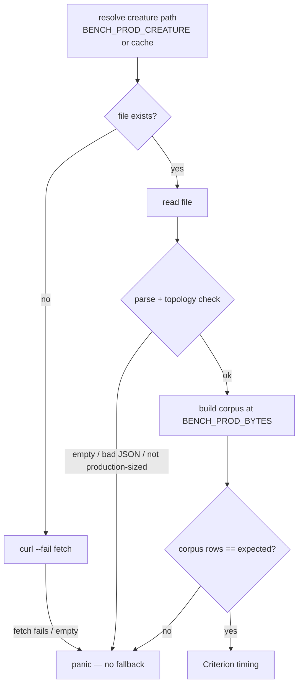

# PR summary — Issue #296

## Summary

Adds a **production-scale benchmark fixture** that gates candidate optimisations
against the real GRQ-cluster creature instead of the synthetic 8→8→2 fixture, and
re-baselines the scorer from it. Closes #296.

- New library module [`rust_scorer/src/prod_fixture.rs`](../../../rust_scorer/src/prod_fixture.rs)
  loads the GRQ-cluster production `network.json` **fail-loud**: it parses,
  topology-checks against production ranges, and returns a hard error (which the
  bench turns into a panic) if the fixture is empty, fails to deserialize, or is
  not production-sized. It **never falls back** to the synthetic fixture, which
  would corrupt every downstream A/B comparison (#297–#299).
- Two new Criterion groups in
  [`rust_scorer/benches/scoring.rs`](../../../rust_scorer/benches/scoring.rs) —
  `production_single_creature` and `production_multi_creature` — fetch the
  creature (≈ 3 MB) at bench time (cached under `target/bench-fixtures/`, not
  committed), build a synthetic corpus with the creature's real 2461-input /
  1-output record shape, and **assert the corpus row count before timing
  starts**.
- `./scripts/run-benches.sh -- production_` runs it; `BENCH_PROD_CREATURE`
  overrides the fetch for offline reproduction; `BENCH_PROD_BYTES` /
  `BENCH_PROD_CREATURES` size it.
- `scripts/profile-flamegraph.sh` gained a `PROFILE_PROD_CREATURE` mode that
  profiles the real creature and writes `-prod`-suffixed SVGs.
- A dated **Production-creature baseline — 7 July 2026** section in
  [`docs/performance-baseline.md`](../../performance-baseline.md) with real
  Apple M4 Criterion median / 95 % CI numbers and refreshed hot-spot tables.
- Per repo isolation, the two dominant hot spots live in `neat_core` and are
  **routed to NEAT-AI-core#227** (evidence posted there), not fixed here.

### Fail-loud flow

## Evidence

Backend/CLI change — no web UI. Verified by real benchmark + flamegraph runs on
the authoritative Apple Silicon host (Apple M4, macOS 26.5.2, arm64).

**Production creature** (fetched live): 2461 inputs / 1 output, 1666 neurons
across **34 distinct squash types**, 21 510 synapses — vs the synthetic 8→8→2
pure-`TANH` fixture.

**Criterion baseline** (`BENCH_PROD_BYTES=33554432` / 32 MiB, `BENCH_PROD_CREATURES=4`):

| Benchmark | Median | 95 % CI | Throughput |
|---|---|---|---|
| `production_single_creature/forward_only` | 13.134 ms | [13.019, 13.201] | 2.3793 GiB/s |
| `production_multi_creature/creatures/1` | 18.914 ms | [18.821, 18.999] | 1.6522 GiB/s |
| `production_multi_creature/creatures/4` | 66.398 ms | [66.051, 66.604] | 481.94 MiB/s |

**Hot spots — the production creature profiles very differently from synthetic:**
`tanhf` (28–48 % active on the synthetic fixture) collapses to 3.7 % / 1.8 %
active — only 12 of 1662 hidden neurons are `TANH`. The cost spreads across the
whole libm transcendental family (34 squash types) and concentrates in
`neat_core::loss::mse_sum_batch_packed` (60.8 % / 72.1 % active). Flamegraphs
committed at `docs/evidence/single-creature-prod.svg` and
`docs/evidence/multi-creature-prod.svg`.

- [Single-creature production flamegraph](../../evidence/single-creature-prod.svg)
- [Multi-creature production flamegraph](../../evidence/multi-creature-prod.svg)

**Scorer-owned hot spots** enumerated for #297–#299: single-creature Rayon
over-parallelism (`swtch_pri` ≈ 24 % active) and the `pending`-compaction
`_platform_memmove` (≈ 4.8 % active). The dominant `neat_core` frames are routed
to NEAT-AI-core#227.

## Test Plan

- `rust_scorer/src/prod_fixture.rs` unit tests (9, all passing) exercise real
  behaviour, not source text:
  - `parse_rejects_empty`, `parse_rejects_garbage` — fail-loud on empty / bad JSON.
  - `topology_accepts_production_sized_creature` — a 2461/1/1666/21 510 creature loads.
  - `topology_rejects_synthetic_fixture` — the 8→8→2 fixture is rejected (guards against a trivially small stand-in).
  - `topology_rejects_non_forward_only`, `topology_rejects_wrong_output_count`.
  - `corpus_record_count_matches_hand_calculation`, `corpus_record_count_is_never_zero`.
  - `resolve_creature_path_prefers_env_override`.
- Bench compilation is CI-gated (`cargo check --benches` / `clippy -D warnings`),
  so a broken fixture-loading path fails on every PR before any bench runs.
- Full `./quality.sh` passes (fmt, clippy `-D warnings`, cargo-deny, check,
  build, test, rustdoc, release build).
- The benches were executed end-to-end on Apple M4 to capture the numbers and
  flamegraphs above.
