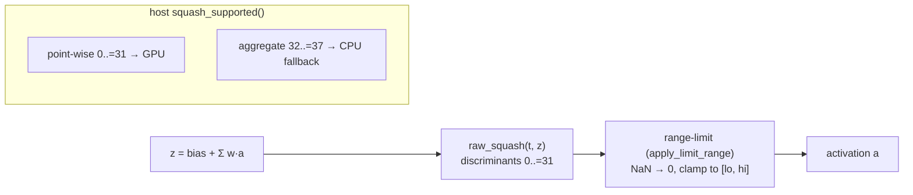

# [perf] Expand GPU squash coverage so the production GRQ creature can run on Metal/Vulkan

## Summary

The GPU `forward_mse_batched` / `forward_mse_scratch` WGSL kernels only inlined
four activations (IDENTITY / RELU / LOGISTIC / TANH), so the production GRQ
creature — spanning ~34 squash types — fell back to CPU on **~95.8 %** of its
neurons and could not use the GPU path at all (Scorer#299, negative).

This PR extends both kernels' activation function to inline **every point-wise
squash** (`SquashType` discriminants `0..=31`), matching the CPU
`neat_core::squash::apply_squash` (f32 path) followed by the
`neat_core::range::apply_limit_range` clamp. The six **aggregate** squashes
(`32..=37`: MINIMUM / MAXIMUM / IF / HYPOT / HYPOTv2 / MEAN) are *not* point-wise
— they combine the individual weighted inputs rather than their sum — so they
remain CPU-only and continue to trigger a clean fallback.

The CPU scoring path is **untouched**; the host `squash_supported()` gate widens
from `{0,1,6,7}` to `0..=31`, and the pre-flight now reports a point-wise
production creature as GPU-hostable. The pre-flight also now **rejects constant
neurons** (`GpuPrepareError::ConstantNeuron`): the CPU returns a clamped bias for
them and ignores their synapses, which the sum-then-squash kernel cannot
reproduce — so a creature carrying one (the real GRQ creature has 3) falls back
to CPU rather than being silently mis-scored.

Whether directory-mode GPU should *default* on for the real GRQ creature is a
separate, benchmark-gated decision. The pre-existing per-path
`auto_should_use_gpu` logic (#82/#83) is unchanged and the CPU path does not
regress, so this coverage work stands on its own regardless of that decision
(exactly as the issue frames it). The production A/B gate needs the GRQ
`network.json` + a multi-GiB corpus, which were **not reachable in this
environment** (the `GRQ-cluster/main/network.json` URL returned `404`); that
final default decision is left for a host with production data — see the
"production GPU" note in `docs/performance-baseline.md`.

Closes #305.

## Evidence

Backend/CLI change — no web UI. Verified on **Apple M4 / Metal 4** hardware.

### CPU↔GPU parity (real GPU dispatch)

`cpu_vs_gpu_pointwise_squash_coverage` builds a creature for each of the 32
point-wise squashes, scores it on both the CPU (`mse_sum_batch_packed`) and the
GPU kernel, and asserts per-creature MSE agreement:

```text
running 7 tests
test cpu_vs_gpu_pointwise_squash_coverage ... ok
test cpu_vs_gpu_n10_creatures_within_relative_tolerance ... ok
test cpu_vs_gpu_n50_creatures_within_relative_tolerance ... ok
test cpu_vs_gpu_large_creature_just_above_cap ... ok
test cpu_vs_gpu_production_scale_4000_neuron_creature ... ok
test cpu_vs_gpu_large_creature_grid_stride_remainder ... ok
test cpu_vs_gpu_handles_partial_workgroup_remainder ... ok
test result: ok. 7 passed; 0 failed
```

### GPU-vs-CPU A/B — synthetic mixed-squash creature

The real GRQ creature was unreachable, so the A/B uses a synthetic
directory-mode creature whose hidden layer cycles the production squash mix
(`BENCH_SCORING_HIDDEN_SQUASH=MIXED`: GELU/SELU/SINE/ABSOLUTE/BENT_IDENTITY/
Cube/HARD_TANH/…). This exercises exactly the coverage the shader now hosts and
confirms the mixed-squash creature runs end-to-end on Metal.

Apple M4 / Metal, `BENCH_SCORING_BYTES=16777216` (16 MiB), `BENCH_SCORING_HIDDEN=32`:

| Directory group (N) | CPU median | GPU median | GPU vs CPU |
|---|---|---|---|
| `creatures/10` | 0.283 s | 0.100 s | **−64.7 %** (2.83×) |
| `creatures/50` | 1.163 s | 0.326 s | **−72.0 %** (3.57×) |

The GPU wins on this mixed-squash shape — the production squash set is
transcendental-heavy, so scalar CPU libm dominates per-neuron cost while the GPU
evaluates activations in parallel. (Before this PR the `gpu_score_from_creature_dir`
bench could not even run the mixed creature — `BatchedRunner::new` rejected the
unsupported squashes.) These synthetic numbers do **not** replace the production
GRQ A/B (issue benchmark gate), which needs the real `network.json` + multi-GiB
corpus on a host with GRQ-cluster access; they confirm the coverage unblocks the
GPU path and does not regress CPU.

### Data flow



## Test Plan

- **`rust_scorer/tests/gpu_multi_score_parity.rs`**
  - `cpu_vs_gpu_pointwise_squash_coverage` (new) — CPU↔GPU parity for all 32
    point-wise squashes, including the production blockers named in the issue.
  - Added `synthetic_creature_json_squash` / `build_varied_records` helpers.
- **`rust_scorer/src/gpu/forward_mse_batched.rs`**
  - `build_batched_network_data_accepts_all_pointwise_squashes` (new) — every
    `0..=31` discriminant is accepted (no CPU fallback).
  - `build_batched_network_data_rejects_aggregate_squashes` (new) — every
    `32..=37` aggregate still yields `UnsupportedSquash`.
  - `build_batched_network_data_rejects_constant_neuron` (new) — a constant
    neuron yields `GpuPrepareError::ConstantNeuron` (CPU fallback), guarding
    against silently mis-scoring the 3 constant neurons in the GRQ creature.
- **`rust_scorer/tests/gpu_preflight_tdd.rs`**
  - `preflight_returns_typed_error_for_unsupported_squash` — updated from
    GAUSSIAN (now hostable) to MEAN (an aggregate, still unsupported). Business
    logic changed: GAUSSIAN is a point-wise squash the shader now hosts.
- Full `./quality.sh` gate (shellcheck, fmt, clippy, check, build, test, doc,
  release build).

## Change type

Backend/GPU-kernel + tests + docs. No CPU-path behaviour change; no public CLI
contract change. New optional bench env var `BENCH_SCORING_HIDDEN_SQUASH`.
Cross-links NEAT-AI#3256.
