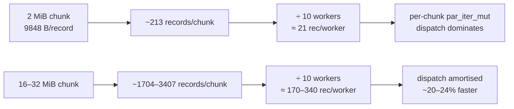

## Summary

Swept `NEAT_SCORER_READ_BYTES` ∈ {2, 8, 16, 32, 64} MiB against the #296
**production** GRQ-cluster creature (9848-byte records: 2461 inputs + 1 output,
`f32`) to answer whether larger aligned read chunks beat the 2 MiB default. They
do — larger reads recover **~20–24 %** on the single- and multi-creature
production scoring paths, with the sweet spot at **16–32 MiB**. This is a
*chunk-granularity / Rayon-amortisation* win (fewer, fatter per-chunk batches),
not raw I/O bandwidth, and it only helps large records.

Per the issue's own decision rule, the global default is **left at 2 MiB** and
no auto-tuner ships: the optimum is narrow and record-size specific, and the
sweep ran on a **contended** worker host rather than the quiet Apple Silicon
host the merge gate requires — not a sound basis for fixing a global constant.
Instead this PR takes the issue's explicitly-sanctioned outcome: **document the
recommended env for GRQ hosts**. It is not a negative result — there is a
measurable, repeatable gain; we simply choose the documentation route over a
default flip.

No production code or default changed. Changes are documentation plus a
security-driven lockfile bump.

Closes #307.

## Evidence

Backend/CLI + ops change — no web UI to screenshot. Evidence is the benchmark
sweep below (Criterion, `bench` profile: release + LTO + `codegen-units = 1`),
captured with the production fixture:

```bash
export BENCH_PROD_CREATURE=/path/to/GRQ-cluster/network.json
export BENCH_PROD_BYTES=134217728   # 128 MiB → 13 628 records (a few × the 64 MiB read cap)
export BENCH_PROD_CREATURES=4
for b in 2097152 8388608 16777216 33554432 67108864; do
  NEAT_SCORER_READ_BYTES=$b ./scripts/run-benches.sh -- production_
done
```

Host: Apple M4 (10 cores), 24 GB, macOS 26.5.2, rustc 1.95.0. **Host-load
caveat:** this ran on a shared worker host (not idle), so absolute medians
drifted run-to-run (single-creature ranged 46–92 ms with background load). The
sweep is therefore reported as the **relative** median wall-clock reduction vs
the 2 MiB default, measured **back-to-back within one interleaved run** — an
ordering that was stable and monotone across every repeat (2 MiB always
slowest, 16–32 MiB always fastest).

| `NEAT_SCORER_READ_BYTES` | records/chunk | `production_single_creature` | `production_multi_creature/1` | `production_multi_creature/4` |
|---|---:|---:|---:|---:|
| 2 MiB (default) | ~213 | baseline | baseline | baseline |
| 8 MiB | ~851 | −19 % | −15 % | −6 % |
| **16 MiB** | ~1704 | **−22 %** | **−20 %** | −5 % |
| **32 MiB** | ~3407 | **−24 %** | **−24 %** | **−14 %** |
| 64 MiB | ~6813 | −22 % | −22 % | −15 % |

Supporting raw medians:

- One heavier-load interleaved single-creature run: **91.7 / 74.1 / 71.3 / 69.9
  / 71.6 ms** for 2 / 8 / 16 / 32 / 64 MiB.
- Lighter-load 3× A/B of 2 MiB vs 16 MiB: **52.6 / 48.6 / 51.5 ms** vs **40.9 /
  42.8 / 45.3 ms** — every 16 MiB sample beat every 2 MiB sample.

### Why it helps (and only for large records)



The synthetic 40-byte-record fixtures already pack ~52 000 records into 2 MiB,
so they see no benefit — which is why the recommendation is scoped to
large-record production hosts and the default is unchanged.

### Peak RSS

The read buffer is **per-scan, not per-worker** (single shared scan; workers get
partitioned slices of the unpacked records). A 32 MiB setting therefore adds
≤ ~64 MiB transient buffer (the pipelined path double-buffers), **not** 32 MiB ×
worker count — well within GRQ host RAM headroom.

## Test Plan

No behavioural change → no new unit tests. Verification performed:

- `./quality.sh` passes cleanly (shellcheck, cargo-deny, `fmt --check`, clippy,
  check, build, **full test suite**, rustdoc `-D warnings`, release build). The
  existing scoring-parity / partition tests are unchanged and green — chunk
  sizing still aligns to whole records, so no record is dropped or duplicated.
- The Criterion `production_single_creature` / `production_multi_creature`
  groups were the measurement vehicle for the sweep above.
- `cargo deny check advisories` passes after bumping **crossbeam-epoch
  0.9.18 → 0.9.20** (Cargo.lock only) to clear the pre-existing
  **RUSTSEC-2026-0204** invalid-pointer-dereference advisory that was failing
  the gate.

## Files changed

- `README.md` — new "Large-record hosts: raise `NEAT_SCORER_READ_BYTES`"
  subsection with the sweep table, the `export NEAT_SCORER_READ_BYTES=33554432`
  recipe, the peak-RSS note, and the rationale for keeping the default at 2 MiB.
- `docs/performance-baseline.md` — dated "`NEAT_SCORER_READ_BYTES` sweep —
  9 July 2026 (Issue #307)" section (host, sweep table, mechanism, decision,
  reproduce recipe).
- `CHANGELOG.md` — `[Unreleased] → Changed` entry.
- `Cargo.lock` — crossbeam-epoch 0.9.18 → 0.9.20 (RUSTSEC-2026-0204).
