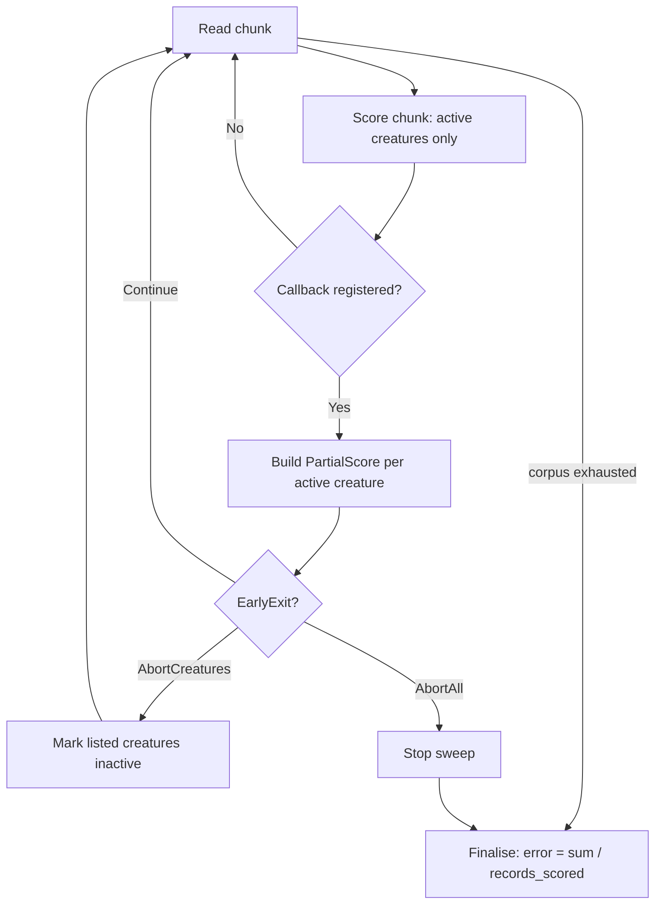

## Summary

Adds an **early-exit / partial-score API** to the directory-mode batch scoring
path — the path production already uses 100 % of the time. A new library
entrypoint `multi_score::score_from_creature_dir_with_early_exit` mirrors
`score_from_creature_dir` but invokes a caller-supplied callback after each
scored chunk. This unblocks [NEAT-AI#3264](https://github.com/stSoftwareAU/NEAT-AI/issues/3264)
(cascading / early-abort fitness ranking) by letting a caller abort creatures
mid-corpus **without reimplementing the fused `mse_sum_batch_packed` loop in
TypeScript**. Closes #308.

The callback receives one `PartialScore` per still-active creature
(`creature_index`, `key`, running `partial_error`, `records_scored`) and returns
an `EarlyExit`:

- `Continue` — keep scoring every active creature.
- `AbortCreatures(indices)` — stop scoring those creatures; each freezes at its
  current partial score (its final `error` over a partial `record_count`).
  Skipping them removes their activation cost from every remaining chunk — the
  wall-clock saving.
- `AbortAll` — stop the sweep immediately; every active creature freezes.

**Full-score path unchanged:** `score_from_creature_dir` (no callback) delegates
to the shared internal `score_from_creature_dir_cpu` with `None`, so its
behaviour and scores are bit-identical to before. A callback that always returns
`Continue` is likewise bit-identical (verified in tests). Per-creature
`record_count` now reflects the records each creature was actually scored
against, which equals the full corpus on the full-score path and the partial
count for an aborted creature.

### API shape chosen

Of the candidate APIs in the issue, this PR takes the **chunk callback on the
directory batch entrypoint** — the least invasive: it reuses the existing
single-pass I/O envelope and flat Rayon worker pool, and adds only a per-chunk
`active`/`records_scored` bookkeeping layer that collapses to a no-op when no
callback is registered.

## Evidence

Backend/CLI change — no web UI to screenshot. Evidence is the benchmark A/B and
the parity/behaviour tests.

### Benchmark gate (merge on ≥5 % directory-mode wall-clock)

`early_exit_directory` group in `rust_scorer/benches/scoring.rs`,
`BENCH_SCORING_BYTES=33554432` (32 MiB corpus), synthetic 8→8→2 population,
callback aborts ~50 % of the population (even indices) after the first scored
chunk. Criterion median wall-clock:

| Population | Full-score (baseline) | Early-exit (abort 50 %) | Δ wall-clock |
|-----------:|----------------------:|------------------------:|-------------:|
| N = 50     | 2.0183 s              | 1.2027 s                | **−40.4 %**  |
| N = 200    | 4.7739 s              | 2.6207 s                | **−45.1 %**  |

Both far exceed the **≥5 %** merge gate. The saving comes from aborted creatures
skipping activation over the remaining chunks; because fitness/activation is
~93.6 % of production wall-clock, removing half the population early recovers
close to half the run.

**Full-score parity (mandatory):** `always_continue_matches_full_score_baseline`
asserts `error`/`score`/`record_count` are **bit-identical** (`to_bits()`)
between `score_from_creature_dir` and the always-`Continue` early-exit path.

### Per-chunk flow

## Test Plan

New integration tests in `rust_scorer/tests/early_exit_tdd.rs` (all drive the
real library entrypoints against a temp corpus, with a tiny
`NEAT_SCORER_READ_BYTES` forcing many streamed chunks):

- `always_continue_matches_full_score_baseline` — full-score parity: an
  always-`Continue` callback returns bit-identical `error`/`score`/`record_count`
  vs `score_from_creature_dir`, and the callback fires on every chunk.
- `abort_creatures_freezes_partial_and_keeps_survivors_exact` — aborting a
  subset freezes their `record_count` below the full corpus while survivors stay
  bit-identical to the baseline.
- `abort_all_stops_sweep_early_for_every_creature` — `AbortAll` on the first
  chunk stops the sweep; every creature has a partial (non-zero, below-full)
  `record_count` and a finite score.
- `partial_score_snapshot_is_well_formed` — the `PartialScore` snapshot exposes
  a finite non-negative running error, a correct `key`, and monotonic
  `records_scored`.

Full `./quality.sh` passes (shellcheck, cargo-deny, fmt, clippy, check, build,
test, rustdoc with `-D warnings`, release build). Existing
`single_pass_assertion` tests still pass, confirming the corpus is still swept
exactly once.

## Out of scope

- **GPU path** (`score_from_creature_dir_gpu`) — early-exit is CPU-only for now;
  production directory-mode uses the CPU pipeline (95.8 % of neurons are
  GPU-unsupported, #299). The GPU batched kernel would need a per-dispatch
  active-mask to benefit, which is a larger change.
- **Single-creature path** — unchanged, per the issue.
