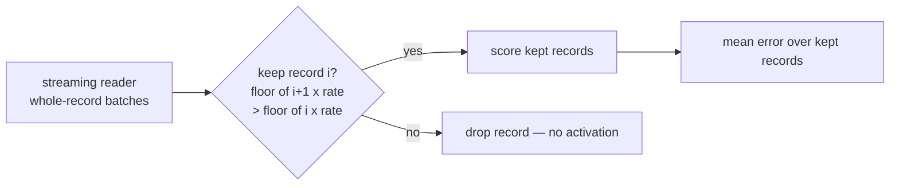

## Summary

Add a record-level `--sample-rate` (with an optional `--sample-phase`) to the
forward-only streaming reader so `rust_scorer` can score a deterministic,
stratified **subsample** of the corpus in a single pass — the multi-fidelity
fitness knob production needs. Production spends ~95 % of its fitness wall-clock
in the forward-only Rust batch path over a single very large corpus file, where
shard-level selection cannot help; the byte cut has to happen inside the
streaming reader, so that is where this lands. **Closes #310.**

The core is a new `sample` module:

- `SampleSpec` — a validated `(rate, phase)` pair. `rate` must be a finite value
  in `(0, 1]`; anything else is rejected (fail loud, Issue #3234).
- `RecordSampler` — a running subsampler threaded across a whole corpus sweep so
  the global record index advances continuously between read chunks. It keeps
  record `i` iff `floor((i + 1) * rate) > floor(i * rate)`, evaluated in `f64`
  exactly as the TS/WASM consumer (`NEAT-AI#3257`) does, so the two engines
  agree bit-for-bit. `filter_in_place` compacts kept records to the front of the
  packed batch (batched paths); `keep_next` mirrors it for the recurrent
  per-record loop.

A single sampler is passed into the shared `run_io_loop`, so **all** streaming
paths inherit sampling with one change: the fused forward-only single-creature
path, the directory (multi-creature) batch path on both CPU and GPU, and the
recurrent per-record path. `recordCount` and `error` in the JSON output reflect
the kept subsample; `--sample-rate 1` (the default) reproduces the full-corpus
result bit-for-bit. `--help` advertises `--sample-rate` so the consumer's
`--help` probe (`resolveProbeState`) can light it up.

Backward-compatible entry points are preserved: `score_from_creature_dir`,
`score_from_creature_dir_gpu` and `accumulate_cost_sum_forward_only_fused` remain
as full-corpus wrappers; new `*_sampled` variants take the `SampleSpec`.

Out of scope (tracked in `NEAT-AI#3257`): the consumer-side confirmation pass
that re-scores elites/winners on the full corpus, and the production-data
correlation gate + release decision (a human cuts the release; the consumer bumps
through the normal dependency-bump flow). No auto-release here.

## Evidence

Backend/CLI change — no web interface to screenshot. Verified end-to-end against
a temp corpus of 8 records where the identity creature's per-record squared error
is `r²` (record `r` has input `r`, target `0`):

```text
=== full (single) ===      "error": 17.5,  "recordCount": 8
=== rate 0.5 (single) ===  "error": 21.0,  "recordCount": 4
=== rate 0.5 (dir)    ===  "error": 21.0,  "recordCount": 4
=== bad rate (2) ===  error: invalid value '2' for '--sample-rate <RATE>':
                      --sample-rate must be a finite value in (0, 1], got 2   (exit 2)
```

Rate 0.5 keeps odd indices `1,3,5,7` → mean squared error `(1+9+25+49)/4 = 21`;
the full corpus mean is `140/8 = 17.5`. The directory (production) path agrees
with the single-creature path.



`./quality.sh` passes cleanly (fmt, cargo-deny, clippy, check, build, test,
doctests, rustdoc with `-D warnings`, release build).

## Test Plan

New tests (all call real functions / the real CLI and assert on results):

- `rust_scorer/src/sample.rs` — `RecordSampler`/`SampleSpec` units: range
  rejection, full pass-through, half/quarter stratified stride, stride
  continuity across batches, phase shift, whole-record preservation, and
  `keep_next` vs `filter_in_place` agreement.
- `rust_scorer/src/stream_io.rs` — `run_io_loop_subsamples_records_across_chunks`
  (rate 0.5 across two chunks sharing one sampler) and
  `run_io_loop_full_sampler_keeps_all_records`.
- `rust_scorer/src/main.rs` — `--sample-rate`/`--sample-phase` parsing, default
  (full), out-of-range rejection (clap + `parse_sample_rate`), `--help`
  advertises the flag, forward-only subsample scoring
  (`test_sample_rate_scores_forward_only_subsample`), and rate-1 parity.
- `rust_scorer/tests/sample_rate_directory.rs` — production directory-mode path:
  `half_rate_scores_stratified_subsample` (forced small reads so the stride must
  stay continuous across many chunks) and `rate_one_matches_full_corpus`.

Existing tests updated only mechanically for the new `run_io_loop` sampler
argument and the new `Cli` fields — no existing test logic changed or removed.
