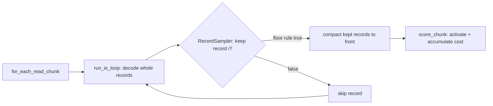

# Record-level `--sample-rate` in the forward-only streaming reader (Issue #310)

## Summary

Adds opt-in **record-level sub-sampling** (multi-fidelity fitness) to
`rust_scorer` so a creature can be scored on a deterministic, stratified
**subsample** of the binary corpus instead of the full corpus — cutting fitness
wall-clock roughly proportionally with **no second corpus on disk**. Production
spends ≈95 % of its fitness wall-clock in the forward-only Rust batch path
(`rust_scorer <creatures_dir> <data_dir>`) over a single ~21 GiB corpus file, so
the byte cut has to happen *inside the streaming reader* — there is no shard to
drop. `Closes #310.`

New CLI flags:

- `--sample-rate <f>` — `(0, 1]`, default `1` (score every record). When `< 1`,
  the reader keeps a stratified subsample: **record `i` is kept iff
  `floor((i+1)·rate) > floor(i·rate)`**. This matches the TypeScript consumer
  (NEAT-AI#3257) stride exactly, so both agree on which records survive.
- `--sample-phase <u64>` — default `0`. Shifts the stride to select a *different*
  subsample of the same size (e.g. rotating the sampled stratum per generation)
  with no randomness.

Design — sampling is threaded through the **one shared** head-and-compact reader
(`run_io_loop`), so it applies uniformly to every scoring path (fused
single-creature, multi-creature CPU, GPU directory, and per-record recurrent).
A stateful `RecordSampler` carries the **global record index** across streamed
chunks, so the kept set is independent of how the reader chunks the bytes. A
full-rate run (`--sample-rate 1`, the default) is a zero-overhead pass-through
and emits the pre-#310 JSON unchanged.

Transparency / never-fail-silently (Issue #3234):

- `error`/`score` are computed over the **kept subset**; `recordCount` is the
  number of records actually scored.
- A new optional `sampleRate` JSON field echoes the effective rate **only when
  sub-sampling ran**, so a consumer can confirm the scorer honoured the flag
  rather than silently ignoring it. Out-of-range rates **fail loud** with a
  non-zero exit (never silently clamped).
- The consumer can probe `--help` for `--sample-rate` (the `resolveProbeState`
  pattern) and pass it on the batch path once a release advertises it.

### Data flow

## Evidence

Backend/CLI change — no web UI to screenshot. Verified via new tests and a
wall-clock benchmark on a synthetic corpus.

**Performance (synthetic corpus, CPU path `--gpu off`, release build, best of 3
runs; 1.5 M records, forward-only 4→128→2 creature so activation dominates):**

| `--sample-rate` | records scored | wall-clock | speed-up |
|-----------------|----------------|------------|----------|
| `1.0` (default) | 1,500,000      | 0.121 s    | 1.00×    |
| `0.5`           | 750,000        | 0.069 s    | 1.76×    |
| `0.25`          | 375,000        | 0.039 s    | 3.15×    |
| `0.1`           | 150,000        | 0.021 s    | 5.67×    |

Wall-clock scales down with the rate; `recordCount` is exactly `floor(N·rate)`;
the score stays stable. The remaining sub-linearity is fixed cost (the corpus
bytes are still streamed once — only per-record *activation* is skipped, which is
where production spends its time).

> **Production gate (needs production data + a human).** Lighting this up on the
> real GRQ corpus is gated on ≥ 5 % `evolveDir` wall-clock **and** rank
> correlation (Spearman/pairwise) of subsample vs full ≥ 0.95, published on
> NEAT-AI#3256 / #3257. This PR does **not** auto-release; the consumer bumps to a
> released scorer through the normal dependency-bump flow once a human cuts the
> release. Cross-links: stSoftwareAU/NEAT-AI#3257, stSoftwareAU/NEAT-AI#3256.

## Test Plan

TDD — the sampler logic and its unit tests were written first, then wired into
every reader path.

- `rust_scorer/src/sampling.rs` (unit): stride correctness vs a reference
  predicate (rate 0.5/0.25 kept indices, `floor(N·rate)` count), **chunk-boundary
  invariance** (same kept set across uneven splits), phase selects a different
  subsample, `keep_next` agrees with `filter_in_place`, out-of-range rejection,
  and `parse_sample_rate` validation.
- `rust_scorer/src/stream_io.rs` (unit):
  `run_io_loop_sub_sampling_drops_records_and_ignores_chunk_splits` — records fed
  in uneven byte chunks yield exactly the kept global indices and `score_chunk`
  never sees an empty chunk. Existing `run_io_loop` tests updated for the new
  sampler argument (full-rate pass-through leaves behaviour unchanged).
- `rust_scorer/tests/sample_rate_tdd.rs` (integration, real binary):
  single-creature half-rate scores `floor(N/2)` records and reports `sampleRate`;
  directory-mode quarter-rate is deterministic across runs and cuts
  `recordCount`; `--sample-phase` selects a different subsample; out-of-range
  rates exit non-zero; `--help` advertises `--sample-rate` for the consumer probe.

All existing tests continue to pass unchanged (full-rate default preserves prior
behaviour and JSON shape). `./quality.sh` passes cleanly (fmt, cargo-deny,
clippy `-D warnings`, check, build, test, rustdoc, release).

## Security self-check

- Input validation: `--sample-rate` is range-validated (`(0, 1]`, finite) at the
  clap boundary **and** in `SampleSpec::new`; malformed/out-of-range values exit
  non-zero. No new I/O, SQL, shell, or network surface. No secrets touched.
