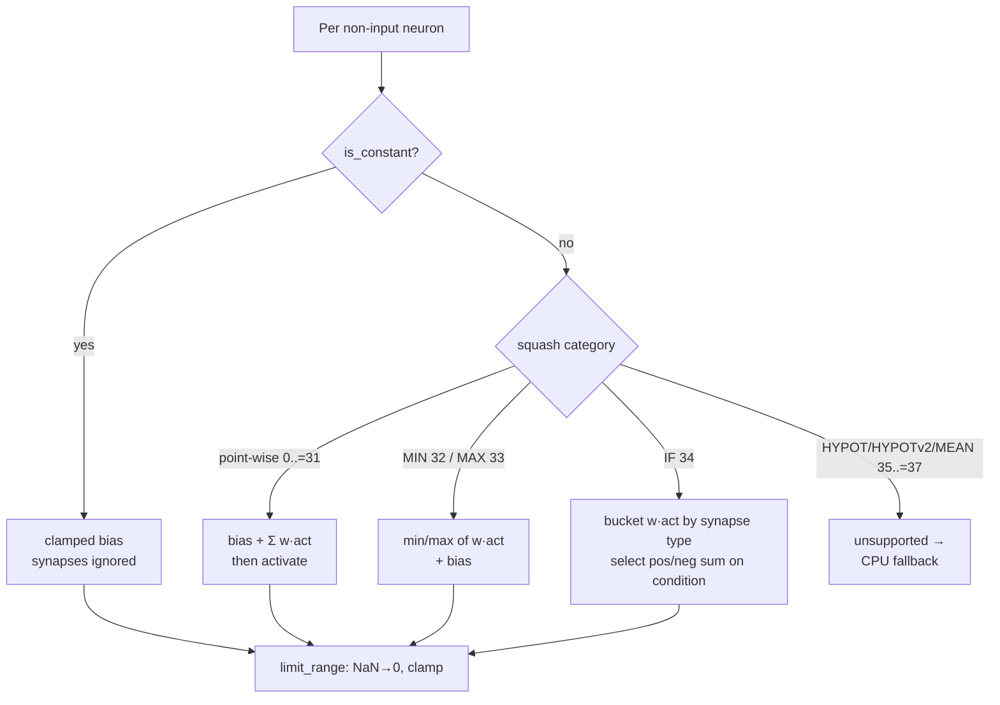

## Summary

GPU-host the aggregate squash neurons **MINIMUM (32) / MAXIMUM (33) / IF (34)**
and **constant neurons** in both WGSL kernels so the real production creature
runs on Metal/Vulkan. **Closes #312.**

Before this change `--gpu auto` kept the real production creature on CPU: hosting is
gated per-creature (`build_batched_network_data`), and the production creature contains
neuron forms the kernel's sum-then-squash path could not express — `IF` (×6,
aggregates by synapse *type*), `MINIMUM` (×4) / `MAXIMUM` (×2) (min/max of
`w·act`, not a sum), and 3 **constant** neurons (clamped bias, synapses ignored).
`TAN` was already hosted by #305, so the remaining blockers were exactly these
aggregate + constant forms.

What changed:

- **Both kernels** (`forward_mse_batched.wgsl`, `forward_mse_scratch.wgsl`) now
  branch the per-neuron accumulation on squash category:
  - point-wise → `bias + Σ w·act` then `activate()` (unchanged, #305);
  - `MINIMUM`/`MAXIMUM` → `min`/`max` of `w·act` then `+ bias` (bias-only when a
    creature has no synapses feeding the neuron, matching the CPU
    `== INFINITY` guard via a bitcast infinity sentinel);
  - `IF` → bucket each `w·act` by synapse type into condition/positive/negative
    sums and select `positive + bias` or `negative + bias` on the condition
    sign;
  - constant neuron → clamped bias (`apply_limit_range(Identity, bias)`),
    synapses ignored.
  All paths finish with the shared `limit_range` (NaN→0, ±range clamp), so the
  results match `neat_core::batch_scoring::neuron_activation_scalar` exactly.
- **`SynapseGpu`** gained a `synapse_type: u32` (populated from
  `SynapseData::synapse_type`) for IF; **`NeuronGpu`** gained `is_constant: u32`.
  Both remain all-scalar `#[repr(C)]` structs, so the std430 array strides stay
  sound (12- and 20-byte, no interior padding).
- **Host gating** (`squash_supported`): discriminants `0..=34` now host;
  `HYPOT`/`HYPOTv2`/`MEAN` (`35..=37`) stay unsupported and force a clean CPU
  fallback. The old `GpuPrepareError::ConstantNeuron` rejection is removed —
  constant neurons are hosted.

The CPU pipeline is untouched, so there is no CPU regression; the change is
purely additive on the GPU path and behind the existing per-creature preflight.

### Neuron accumulation branch (new)

## Evidence

Backend/CLI + GPU-shader change — no web UI to screenshot. Verified on **Apple
M4 Pro / Metal** (this host has a real adapter, so the GPU parity tests execute
rather than skip).

**CPU↔GPU parity (relative error < 1e-3), `tests/gpu_multi_score_parity.rs`:**

- `cpu_vs_gpu_minimum_aggregate`, `cpu_vs_gpu_maximum_aggregate`,
  `cpu_vs_gpu_if_aggregate` — one aggregate per creature.
- `cpu_vs_gpu_mixed_aggregates_and_constant_neuron` — MIN + MAX + IF + constant
  in one creature (the production mix).
- `cpu_vs_gpu_real_prod_creature_when_available` — scores the **actual** production
  `network.json` (1666 neurons, IF ×6 / MIN ×4 / MAX ×2, 3 constant neurons)
  when `BENCH_PROD_CREATURE` is set. Ran green against the local creature.

All 11 GPU parity tests + 16 host unit tests pass; `./quality.sh` passes clean
(shellcheck, fmt, clippy, check, build, test, rustdoc, release build).

**Production A/B (`production_gpu_vs_cpu`, 16 MiB corpus / 1703 records):**

| Pool `N` | CPU median | GPU median | GPU vs CPU |
|---|---|---|---|
| 8  | 128.2 ms `[126.96, 129.39]` | 217.4 ms `[214.89, 221.92]` | **+69.6 % (1.70× slower)** |
| 50 | 952.9 ms `[937.97, 968.30]` | 868.0 ms `[863.97, 871.97]` | **−8.9 % (1.10× faster)**, non-overlapping CIs |

The GPU amortises across the creature pool (one dispatch scores every
`(creature, record)` pair): it loses by 1.7× at a small pool but pulls ahead by
~9 % at a realistic evolution population (`N=50`), with a break-even in between.

**Default decision:** the hosting work merges on its own merits (real production
creature now hostable with verified parity, CPU path untouched). The A/B is a
**crossover**, not a clean win, so the `--gpu auto` default is *not* flipped
here — a population-size-aware `auto_should_use_gpu` threshold is left to the
parent [NEAT-AI#3256](https://github.com/stSoftwareAU/NEAT-AI/issues/3256)
wall-clock decision, since it changes the #82/#83 heuristic. Full write-up in
[`docs/performance-baseline.md`](../../performance-baseline.md) (#312 section).

## Test Plan

Added / modified in `rust_scorer/tests/gpu_multi_score_parity.rs`:

- `cpu_vs_gpu_minimum_aggregate`, `cpu_vs_gpu_maximum_aggregate`,
  `cpu_vs_gpu_if_aggregate` — aggregate parity on a real adapter.
- `cpu_vs_gpu_mixed_aggregates_and_constant_neuron` — combined production mix.
- `cpu_vs_gpu_real_prod_creature_when_available` — real production `network.json`
  parity, gated on `BENCH_PROD_CREATURE`.

Added / modified host unit tests in `rust_scorer/src/gpu/forward_mse_batched.rs`:

- `build_batched_network_data_accepts_min_max_if_aggregates` (was
  `..._rejects_aggregate_squashes`) — 32..=34 now accepted, discriminant
  serialised unchanged.
- `build_batched_network_data_rejects_remaining_aggregate_squashes` — 35..=37
  still rejected.
- `build_batched_network_data_accepts_constant_neuron` (was
  `..._rejects_constant_neuron`) — constant neurons now hosted, `is_constant`
  serialised; behaviour change documented (Issue #312 supersedes the #305
  rejection).
- `build_batched_network_data_populates_synapse_type` — new; asserts the
  `SynapseType` u8→u32 widening.
- `build_batched_network_data_rejects_unsupported_squash` — updated to use MEAN
  (37) since MINIMUM (32) is now hosted.

Added `rust_scorer/benches/scoring.rs::bench_production_gpu_vs_cpu` — the real
production CPU↔GPU A/B used for the numbers above.
