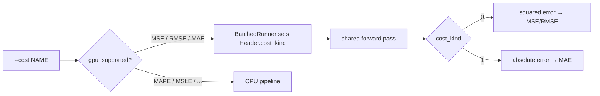

# GPU scoring: host MAE on the batched/scratch kernels (parity with MSE)

## Summary

Hosts `--cost MAE` on the same multi-creature GPU path as MSE/RMSE, so one run
can score the production creature set with either cost on the GPU. **Closes #316.**

Both GPU kernels (`forward_mse_batched` for ≤256-neuron creatures,
`forward_mse_scratch` above) already run one shared forward pass and then reduce
a per-record loss. Rather than duplicating ~340 lines of shader per cost, the
kernels now select the reduction from a new `cost_kind` header field:

- `MSE` / `RMSE` accumulate **squared** error (unchanged; RMSE keeps its
  host-side `sqrt` at finalisation).
- `MAE` (this change) accumulates **absolute** error on the identical forward
  pass — GPU-hosted on both the private-array and the >256-neuron scratch
  kernels used by production GRQ creatures.

The `cost_kind` value comes from a new `CostKind::gpu_error_code()` (0 = squared,
1 = absolute) written into the previously-unused header padding slot, so no new
buffers, bind groups, or dispatches are added. `CostKind::gpu_supported()` now
returns `true` for MAE, so `--gpu on --cost MAE` no longer hard-errors and
`--gpu auto --cost MAE` no longer forces a cost fallback (topology-based
CPU fallback for Mixed/ScratchOnly pools under `auto` is unchanged — Issue #317).



## Acceptance criteria

- [x] `rust_scorer --gpu on --cost MAE <creature_dir> <data_dir>` scores the set
      on GPU (`gpuBackend` ≠ `cpu-fallback`).
- [x] Same run emits one result per creature JSON and reads training bins once
      (single sweep, unchanged I/O envelope).
- [x] `--gpu auto --cost MAE` prefers GPU when a compatible adapter hosts the
      set (no forced cost fallback).
- [x] Parity test on a production-shaped fixture (mixed private + >256-neuron
      scratch creatures, `TANH` hidden layer — not a trivial identity creature).
- [x] README / `--help` / AGENTS.md no longer say the GPU path is MSE-only.

## Evidence

Backend/CLI change — no web UI. Verified on Apple Silicon (Metal):

**`--gpu on --cost MAE`** on a mixed pool (3 small + 1 large 310-neuron creature):

```text
large-0  backend=metal  kernel=forward_mse_batched+forward_mse_scratch  cost=MAE err=109.10  records=4096
small-0  backend=metal  kernel=forward_mse_batched+forward_mse_scratch  cost=MAE err=0.146604 records=4096
```

**`--gpu auto --cost MAE`** on an all-private pool: all 8 creatures →
`backend=metal`, no cost-fallback note on stderr (previously all fell back to
`cpu-fallback`).

**MAE vs MSE diverge on the same GPU run** (proves `cost_kind` is honoured, not
always squaring): `small-0 MAE=0.146604 MSE=0.041…`.

## Test Plan

New/updated tests (all green; GPU tests run on the Metal host and skip cleanly on
CPU-only CI):

- `tests/gpu_mae_parity.rs::gpu_mae_matches_cpu_mae_and_diverges_from_mse` — new.
  MAE GPU↔CPU parity within the #81 tolerance on a mixed private+scratch fixture,
  asserts the scratch kernel actually ran under MAE, and that MAE ≠ MSE on the
  same GPU run.
- `src/cost.rs` — `gpu_supported_for_mse_rmse_and_mae`,
  `gpu_error_code_distinguishes_squared_and_absolute` (new); doctests for
  `gpu_supported`/`gpu_error_code`.
- `src/gpu/mod.rs` — `auto_should_use_gpu_directory_uses_gpu_for_mae`,
  `auto_cost_fallback_note_absent_for_mae_directory` (new); the "non-MSE falls
  back" lists now use MAPE (MAE is GPU-hosted).
- `src/main.rs` — `test_gpu_on_accepts_mse_rmse_and_mae`,
  `test_help_notes_gpu_cost_constraint` (updated for MAE support).
- `tests/scorer_smoke.rs`, `tests/directory_mode_tdd.rs` — the CPU-fallback /
  `--gpu on` hard-error cases now use MAPE (still unhosted); the single-creature
  `--cost MAE` CPU-path test is retained (single-creature is always CPU, #81).
- `tests/gpu_bind_group_reuse.rs`, `tests/gpu_multi_score_parity.rs` — updated
  for the new `BatchedRunner::new(..., cost)` signature (pass `CostKind::Mse`).

## Security self-check

Backend/CLI compute change with no new external input surface, no secrets, no
new dependencies. `cost_kind` is a bounded `u32` selector written host-side; the
shader treats it as a plain branch value.
