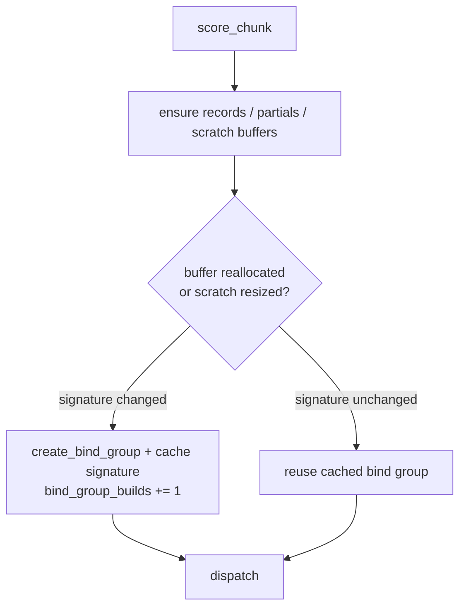

# PR summary — Issue #322

## Summary

Reduce GPU per-dispatch overhead by **reusing the batched runner's bind group
across dispatches** — experiment 2 of #322 (parent #318). `Closes #322`.

`BatchedRunner::score_chunk` previously called `device.create_bind_group` — plus
allocating a fresh `bind_entries` `Vec` — on **every** dispatch. The immutable
per-creature SSBOs (`header`, `neurons`, `synapses`, `creatures`) never change,
so a bind group only goes stale when a growable buffer
(`records`/`partials`/`scratch`) is reallocated or the scratch binding is
resized. The runner now caches the bind group and rebuilds it **only** on that
signature change, tracked by a monotonic reallocation-generation counter per
growable buffer plus the bound scratch size.

This is a correctness-preserving dispatch-overhead reduction. It does **not**
flip `--gpu auto` routing — production topology is `ScratchOnly`, which still
selects CPU per #317/#319 — it lowers the fixed cost of every GPU dispatch on the
`--gpu on` and all-private `auto` paths.

The three remaining #322 experiments (64 MiB read default; async readback beyond
`inflight=2`, blocked by the #319 Metal SIGSEGV; Metal-native micro-benchmark)
need the proprietary full 521-bin production corpus or are non-shipping spikes, and are
tracked in follow-up **#333**.

### Reuse decision

## Evidence

Backend/CLI change — no web interface to screenshot. Verified with a
before/after benchmark plus unit + GPU parity tests.

**Benchmark** — [`gpu_pipeline_alloc_bench`](../../../rust_scorer/src/bin/gpu_pipeline_alloc_bench.rs)
(8 creatures, 100 000 records, `READ_BYTES=2560` → deliberately dispatch-heavy so
the per-dispatch fixed cost dominates). Host: **Apple M4 Pro** (Mac16,11), macOS,
Metal backend. Median of 3 runs.

| Metric | Baseline (create per dispatch) | Bind-group reuse | Δ |
|---|---|---|---|
| `gpu_dispatch_count` | 1563 | 1563 | — |
| allocations (scored) | 117 277 | 86 037 | **−31 240 (−26.6 %)** |
| `elapsed_secs` | 10.80 | 10.15 | **~−6.0 %** |

~20 heap allocations removed per dispatch (the `bind_entries` `Vec` plus the
wgpu-internal bind-group allocations). The saving is per-dispatch, so absolute
wall-time impact scales with dispatch count. Recorded in
[`docs/performance-baseline.md`](../../performance-baseline.md) under
"Production GPU dispatch overhead — 12 July 2026".

**Ship-gate note.** #322's full ship gate (≥3 % CPU win on the full 521-bin production
corpus, combined with #319 + kernel work) governs flipping the production default
to GPU and needs proprietary data unavailable to the worker. This PR delivers the
self-contained, measurable dispatch-overhead reduction and tracks the residual
corpus/hardware-gated experiments in #333 rather than looping.

## Test Plan

CPU-only unit tests (run on CI) for the pure reuse decision, in
`rust_scorer/src/gpu/forward_mse_batched.rs`:

- `bind_group_rebuilds_when_no_group_cached_yet` — first dispatch always builds.
- `bind_group_reused_when_signature_unchanged` — steady state reuses.
- `bind_group_rebuilds_when_records_buffer_grows` — realloc invalidates.
- `bind_group_rebuilds_when_scratch_binding_resized` — resized scratch invalidates.

GPU-gated integration tests (run on the M4 Pro; skip cleanly with no adapter), in
`rust_scorer/tests/gpu_bind_group_reuse.rs`:

- `same_size_chunks_reuse_one_bind_group` — 5 identical dispatches build once.
- `growing_chunk_forces_exactly_one_rebuild` — a larger chunk rebuilds once; a
  return to a covered shape does not rebuild.
- `reused_bind_group_preserves_cpu_parity` — GPU sums match the CPU
  `mse_sum_batch_packed` baseline across three dispatches that reuse the group.

Existing CPU↔GPU parity suite (`tests/gpu_multi_score_parity.rs`) and
`./quality.sh` pass cleanly.
