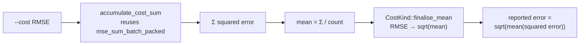

# feat: add RMSE to CostKind — CPU dispatch + host-sqrt finalisation (Issue #338)

## Summary

Makes `--cost RMSE` a first-class, selectable cost on every **CPU** scoring path
of `rust_scorer`, computing `sqrt(mean(squared error))` by **reusing** the
existing MSE accumulation with a single host-side `sqrt` applied only at
finalisation. No new per-record loss code and no performance regression — RMSE
shares MSE's `mse_sum_batch_packed` helper. Closes #338.

RMSE is the first cost whose finalisation is *not* a plain `sum / count`. Rather
than sprinkling `if cost == Rmse { .sqrt() }` inline, a single shared helper
`CostKind::finalise_mean(mean) -> f64` (returns `mean.sqrt()` for RMSE, `mean`
otherwise) is called at every CPU finalisation site, so the `sqrt` cannot drift
between paths. The GPU finalisation site (`multi_score.rs:1233`) is handled by
the separate GPU sub-issue and will call the same helper.

### Changes

- **`rust_scorer/src/cost.rs`**
  - New `Rmse` variant on `CostKind` with `#[value(name = "RMSE")]`.
  - `as_str()` arm → `"RMSE"`.
  - Dispatch arm folds `Rmse` into the existing MSE arm so both route through
    `loss::mse_sum_batch_packed` (identical squared-error accumulation).
  - New `CostKind::finalise_mean(mean)` shared finalisation helper.
  - `RMSE` is **not** GPU-supported (kernel is MSE-only) — locked by the
    existing `gpu_supported_only_for_mse` test.
- **`rust_scorer/src/main.rs`** — single-creature finalisation site now calls
  `cost.finalise_mean(total_error / record_count)` (covers both the
  fused-stream and recurrent-iterator branches that funnel here).
- **`rust_scorer/src/multi_score.rs`** — CPU creature-directory finalisation
  site now calls `cost.finalise_mean(total_mse[ci] / scored)`.
- **Docs** — README cost table + examples and `AGENTS.md` updated to list
  `RMSE`.

### Data flow



## Evidence

Backend/CLI change — no web interface to screenshot. Verified end-to-end that
`rust_scorer --cost RMSE …` runs and echoes the resolved cost name:

```json
{ "error": 0.0, "costName": "RMSE" }
```

(`error` is `0.0` here because the identity fixture predicts its data perfectly;
`sqrt(0) == 0`. The `sqrt` semantics are proven numerically by the parity tests
below.)

## Test Plan

Unit tests (`rust_scorer/src/cost.rs`):
- `rmse_as_str_and_default_unchanged` — `Rmse.as_str() == "RMSE"`, `RMSE` parses
  via `from_cli`, default cost is still `MSE`.
- `finalise_mean_applies_sqrt_only_for_rmse` — `sqrt` for RMSE, no-op for every
  other cost.
- `accumulate_cost_sum_rmse_reuses_mse_then_sqrt_finalises` — RMSE accumulates
  the *same* squared-error sum as MSE; finalised RMSE == `sqrt(MSE)`.
- Extended `from_cli_accepts_every_built_in_cost_name`,
  `from_cli_rejects_unknown_cost_name`, and `gpu_supported_only_for_mse` to
  include `RMSE`.

Parity tests (`rust_scorer/tests/cost_parity.rs`):
- `parity_rmse_equals_sqrt_of_mse` — on identical data the finalised
  `RMSE == sqrt(MSE)` using the exact CPU finalisation arithmetic.
- `parity_rmse_ranks_creatures_same_order_as_mse` — RMSE ranks a fixed set of
  datasets in the *same order* as MSE (monotonic transform preserves selection
  order).

All `cargo test` unit + parity tests pass and `./quality.sh` runs clean
(`-D warnings`).
