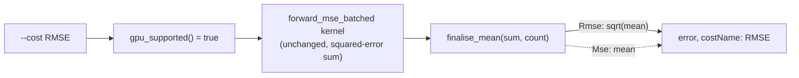

# Serve RMSE on the existing GPU MSE kernel via a host-side `sqrt`

## Summary

`--cost RMSE` now runs on the **GPU** creature-directory path at full MSE
speed, reusing the existing `forward_mse_batched` kernel with only a host-side
`sqrt` at finalisation — **no new GPU kernel** (honouring the #318/#323
GPU-exhaustion constraint). The kernel already returns the squared-error sum
RMSE needs; only the `mean → sqrt(mean)` finalisation and the GPU-gating
predicate change. Closes #339.

RMSE's foundation (the `CostKind::Rmse` variant, its CPU dispatch, and the
shared `finalise_mean` helper) was scoped to the dependency sub-issue #338,
which had not yet landed on the milestone branch. Since #339 cannot compile or
be tested without it, this PR delivers that foundation alongside the GPU work so
the change is a self-contained, mergeable unit. Documentation of the new cost
(README / CHANGELOG) remains with #341, and the upstream `BUILT_IN_COST_NAMES`
sync remains with #340.

### What changed

- **`rust_scorer/src/cost.rs`**
  - Added the `Rmse` variant (`--cost RMSE`, `costName: "RMSE"`).
  - `gpu_supported()`: `matches!(self, Self::Mse | Self::Rmse)` — RMSE reuses
    the MSE kernel, so it is genuinely GPU-supported.
  - `accumulate_cost_sum`: RMSE dispatches to `mse_sum_batch_packed` unchanged —
    the `sqrt` lives only in finalisation, never in the per-chunk sum.
  - New shared `finalise_mean(error_sum, record_count)` helper: divides by the
    record count and applies `sqrt` for — and only for — RMSE.
- **Three finalisation sites now route through `finalise_mean`** so RMSE gets
  its `sqrt` identically everywhere:
  - `main.rs` single-creature path,
  - `multi_score.rs` CPU creature-directory path,
  - `multi_score.rs` GPU creature-directory path (the site the issue targets).
- **`main.rs`** `--cost` help text and the `--gpu on` guard comment updated to
  note RMSE is served by the MSE-only kernel via a host-side `sqrt`.
- **Gating (`gpu/mod.rs`)** needed no logic change — `auto_should_use_gpu`,
  `auto_should_use_gpu_directory`, `auto_cost_fallback_note`, and
  `auto_topology_fallback_note` all key off `cost.gpu_supported()`, so RMSE is
  treated like MSE automatically. Test coverage added to lock that.

### Data flow

## Evidence

Backend/CLI change — no web UI to screenshot. Verified end-to-end on a real
Metal GPU (this build host):

| Command | `costName` | `error` | backend / kernel |
| --- | --- | --- | --- |
| `--gpu off  --cost MSE`  | `MSE`  | `0.25` | cpu-fallback |
| `--gpu off  --cost RMSE` | `RMSE` | `0.50` | cpu-fallback |
| `--gpu on   --cost RMSE` | `RMSE` | `0.50` | metal / `forward_mse_batched` |
| `--gpu auto --cost RMSE` | `RMSE` | `0.50` | metal / `forward_mse_batched` |

`RMSE = sqrt(MSE) = sqrt(0.25) = 0.5` confirms the host-side `sqrt`, and
`--gpu on --cost RMSE` no longer hard-errors — it runs on the MSE kernel.

The GPU↔CPU RMSE parity integration test ran (not skipped) on this host's GPU
and passed, confirming GPU RMSE matches CPU RMSE within the #81 tolerance and
equals `sqrt` of the MSE score on the same GPU run.

## Test Plan

Added / updated tests (all pass; `./quality.sh` green):

- `rust_scorer/src/cost.rs`
  - `gpu_supported_only_for_mse` → renamed/extended to
    `gpu_supported_only_for_mse_and_rmse` (RMSE GPU-supported; the other six
    are not).
  - `finalise_mean_applies_sqrt_only_for_rmse` — `sqrt` for RMSE, plain mean
    otherwise; RMSE == `sqrt` of the MSE finalisation.
  - `accumulate_cost_sum_rmse_matches_mse_sum` — RMSE reuses the MSE
    squared-error sum bit-for-bit.
  - `from_cli_accepts_rmse` — `--cost RMSE` parses; case-sensitive.
- `rust_scorer/src/gpu/mod.rs`
  - `auto_should_use_gpu_directory_uses_gpu_for_rmse` — RMSE is GPU-eligible
    like MSE.
  - `auto_cost_fallback_note_absent_for_rmse_directory` — RMSE emits no
    "not GPU-supported" CPU-fallback note.
- `rust_scorer/src/main.rs`
  - `test_cli_parses_rmse` — clap accepts `--cost RMSE`.
  - `test_gpu_on_accepts_mse_and_rmse_only` — the `--gpu on` guard clears for
    MSE/RMSE and still trips for CPU-only costs.
- `rust_scorer/tests/gpu_rmse_parity.rs` (new, GPU-gated)
  - `gpu_rmse_matches_cpu_rmse_and_is_sqrt_of_mse` — GPU↔CPU RMSE parity within
    #81 tolerance **and** RMSE == `sqrt` of the MSE score on the same GPU run
    (guards the finalisation routing at `multi_score.rs`).
