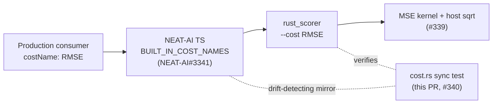

# Sync RMSE into upstream NEAT-AI `BUILT_IN_COST_NAMES`

## Summary

Coordinates the cross-repo half of end-to-end `costName: "RMSE"` support. RMSE
is now a first-class **upstream** built-in cost, and this repo pins a
drift-detecting test so the rust `CostKind` list and the TypeScript
`BUILT_IN_COST_NAMES` tuple cannot silently diverge on RMSE. **Closes #340.**

The work spans two repos, per the issue scope:

1. **Upstream (companion PR):** `stSoftwareAU/NEAT-AI#3341` adds an `RMSE` cost
   class and inserts `RMSE.NAME` into `BUILT_IN_COST_NAMES` (next to `MSE`), so
   upstream config validation accepts `costName: "RMSE"` and passes it through
   `NeatOptions.costName` unchanged.
2. **This repo (scorer):** the sync-verification test + comment updates below.
3. **End-to-end release + production consumer bump (human-gated):** tracked in
   `stSoftwareAU/NEAT-AI#3342`. Per the release-gating rule the NEAT-AI release
   and the downstream bump are a human action — this PR does **not** auto-merge
   or publish anything.

### What changed (this repo)

- **`rust_scorer/src/cost.rs`**
  - New test `cost_kind_stays_in_sync_with_upstream_built_in_cost_names`: a
    verbatim mirror of the upstream tuple (now including `RMSE`). It fails
    `cargo test` the moment either list drops a shared name — every mirrored
    name must parse via `CostKind::from_cli` and render back byte-for-byte, and
    `RMSE` is asserted present explicitly. The rust side stays a superset
    (`CATEGORICAL_ERROR` is scorer/neat-core-only), so the test asserts the
    upstream→rust direction only.
  - Module header + `from_cli_accepts_rmse` doc updated: `RMSE` is no longer a
    "not-yet-upstream" scorer extension — it is synced (`NEAT-AI#3341`).
- **`rust_scorer/src/main.rs`** — `test_cli_parses_rmse` comment refreshed to
  reflect the completed sync.

Documentation of the cost itself (README / CHANGELOG) stays with #341; upstream
`BUILT_IN_COST_NAMES` sync is this issue (#340), matching the split recorded in
`pr-summary-339.md`.

## Evidence

Backend/CLI change — no web UI to screenshot. Verified by the rust test suite
and the upstream Deno suite.

- Scorer: `cargo test -p rust_scorer --lib cost::` → **18 passed**, including
  the new drift test.
- Drift test proven to fail-loud: temporarily removing `RMSE` from the mirror
  made `cost_kind_stays_in_sync_with_upstream_built_in_cost_names` **FAIL**, then
  pass again once restored.
- Upstream (`NEAT-AI#3341`): `deno test test/costs/CostName.ts
  test/costs/CostsRegistry.ts` → **16 passed**; `PublicAPI.ts` → **20 passed**.

## Test Plan

- `rust_scorer/src/cost.rs::cost_kind_stays_in_sync_with_upstream_built_in_cost_names`
  — new drift test mirroring the upstream tuple; fails if RMSE (or any shared
  built-in) drifts between the two lists.
- Existing `from_cli_accepts_rmse`, `gpu_supported_only_for_mse_and_rmse`,
  `finalise_mean_applies_sqrt_only_for_rmse`, and
  `accumulate_cost_sum_rmse_matches_mse_sum` continue to pass.
- Full `./quality.sh` gate (fmt, cargo-deny, clippy, check, build, test,
  rustdoc, release build) run clean locally.
