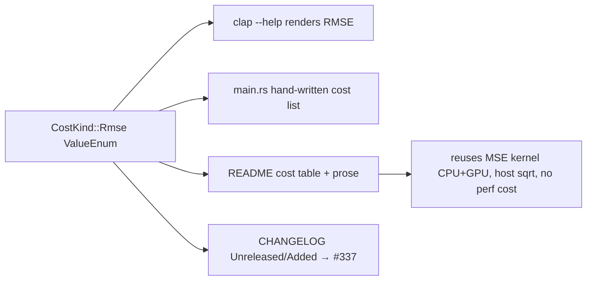

# PR Summary — Document the RMSE cost (Issue #341)

## Summary

Documents the new `RMSE` cost so users and production operators can discover and request
it, and records the change. The `RMSE` variant, its CPU dispatch (#338) and its
GPU support via the shared MSE kernel (#339) already landed on the milestone
branch; this PR consolidates the **hand-written** documentation those sub-issues
left partial or stale.

- **README cost table** — corrected the `RMSE` GPU column from the now-stale
  `No (CPU)` (written by #338, *before* #339 added GPU support) to
  **`Yes` (MSE kernel)**, and expanded the meaning to
  *`sqrt(mean(squared error))` — ranks identically to MSE, reports same-unit
  magnitudes*.
- **README prose** — added a note that `RMSE` reuses the MSE squared-error
  accumulation on **both** CPU and GPU with only a host-side `sqrt` at
  finalisation, so there is **no performance difference versus `MSE`** on either
  backend.
- **README GPU-constraint section + `auto`-mode row** — reworded so the CPU
  fallback language applies only to the remaining GPU-unsupported costs; `MSE`
  and `RMSE` both run on the shared `forward_mse_batched` kernel.
- **CLI `--cost` `--help`** — `RMSE` is rendered automatically by clap from the
  `CostKind` `ValueEnum` variant; additionally added `RMSE` to the hand-written
  cost enumeration in the long-help doc comment (`main.rs`) so the help text no
  longer omits it.
- **CHANGELOG** — added an `[Unreleased] → Added` entry for the `RMSE` cost,
  linked to **#337**.
- **AGENTS.md** — corrected the GPU-kernel note to state the kernel serves both
  `MSE` and `RMSE`.
- **Pre-existing breakage fixed** — `rust_scorer/tests/cost_parity.rs` still
  called `CostKind::finalise_mean()` with the old single-argument signature
  (#338); #339 changed it to `(error_sum, record_count)`. Updated the three call
  sites to the current API. The tests' assertions are unchanged — this is a
  compile-fix for a signature refactor, not a test rewrite.

Closes #341

## Cost documentation flow

## Evidence

Docs + CLI-help change; no web interface to screenshot. Verified against the
built binary and the quality gate:

- `./target/release/rust_scorer --help` renders `RMSE` in the `--cost` possible
  values, in the GPU-constraint note, and in the corrected hand-written cost
  enumeration (`MSE`, `RMSE`, `MAE`, …).
- `./quality.sh` passes cleanly (shellcheck, cargo-deny, `fmt --check`, clippy,
  check, build, test, rustdoc with `-D warnings`, release build), including the
  RMSE parity tests in `cost_parity.rs`.

## Test Plan

- **No new behaviour** is introduced by this docs PR, so no new tests were added.
- Repaired the pre-existing compile failure in
  `rust_scorer/tests/cost_parity.rs::parity_rmse_equals_sqrt_of_mse` and
  `::parity_rmse_ranks_creatures_same_order_as_mse` by updating the
  `finalise_mean` call sites to the current `(error_sum, record_count)` signature;
  both tests now compile and pass, re-confirming `finalised RMSE == sqrt(MSE)` and
  identical MSE/RMSE ranking.
- `cargo test` (via `./quality.sh`) green, including the `CostKind::finalise_mean`
  and `gpu_supported` doctests.
