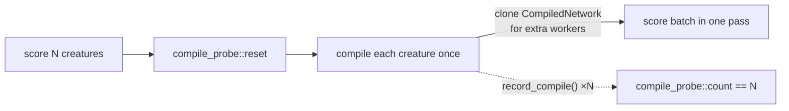

## Summary

Replaced the flaky wall-clock threshold assertion (`compileTimeSecs < 1.0`) in
`rust_scorer/tests/directory_mode_tdd.rs` with a behavioural (WHAT) guard on the
real invariant it was meant to protect: directory-mode scoring compiles each
creature **exactly once** (Issue #42), not once per (creature × worker).

The old upper bound was both flaky and toothless — it could fail on a saturated
CI runner without any regression, yet 32 sub-millisecond recompiles of the tiny
fixtures would still land far under 1.0 s, so it could also pass *with* the
regression. Wall-clock budgets belong in a benchmark, not the test runner.

This PR takes both remedies the audit suggested: it **deletes** the toothless
upper bound from the subprocess contract test (keeping the `compileTimeSecs >=
0.0` JSON shape assertion) and **adds** a behavioural compile-count probe that
asserts the invariant directly.

Closes #355.

## What changed

- `rust_scorer/src/multi_score.rs`: added a process-global `compile_probe`
  module (`reset` / `count` / `record_compile`), mirroring the existing
  `training_pass_probe`. `record_compile()` is called at each `compile_creature`
  site in the **batch scoring paths** (CPU and GPU) — not the CPU-only
  pre-flight hostability/topology probes, which are not part of the scoring pass.
- `rust_scorer/tests/directory_mode_tdd.rs`: removed the `compile_secs < 1.0`
  wall-clock assertion; kept the non-negative JSON-shape assertion; updated the
  doc comment to point at the new behavioural test.
- `rust_scorer/tests/compile_once_assertion.rs` (new): resets the probe, scores
  a directory of N creatures on the CPU path, and asserts the observed compile
  count equals N. The pre-#42 per-worker recompile would report `N × workers`
  on any multi-core host and fail the `assert_eq!`.

## Evidence

Backend/CLI change — no web interface to screenshot. Verified via the test
suite.

Affected tests (all green under `cargo test` and `./quality.sh`):

- `compile_once_assertion::multi_creature_batch_compiles_each_creature_once`
  (N ∈ {2, 5, 11}) — new behavioural guard reproducing the Issue #42 invariant.
- `compile_once_assertion::single_creature_compiles_once`.
- `directory_mode_tdd::directory_mode_emits_compile_time_secs` — JSON contract
  still enforced, minus the flaky wall-clock cap.
- `single_pass_assertion::*` — unchanged, still green (the sibling probe pattern
  this change mirrors).

## Test Plan

- `cargo test -p rust_scorer --test compile_once_assertion --test
  directory_mode_tdd --test single_pass_assertion` — all pass.
- `./quality.sh` — full gate passes (fmt, clippy, check, build, test, doc,
  release).
