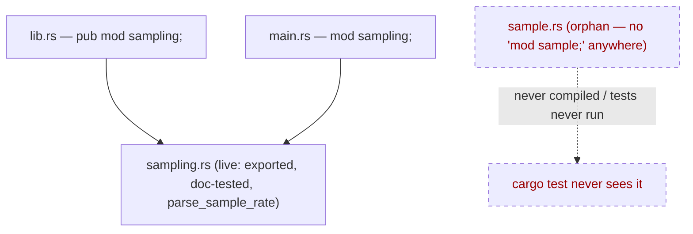

## Summary

`rust_scorer/src/sample.rs` (344 lines, including an inline `#[cfg(test)] mod tests`)
was never declared as a module — there was no `mod sample;` in `lib.rs`,
`main.rs`, or anywhere else. The crate declares only the near-duplicate
`sampling` module (`lib.rs:24`, `main.rs:18`). The file and every test inside it
therefore never compiled and never ran under `cargo test`, giving a false
impression of behavioural coverage.

Both `sample.rs` and `sampling.rs` were introduced together in PR #314 (Issue
#310). `sampling.rs` is the **live** implementation: it is declared, exported,
doc-tested, and additionally carries `parse_sample_rate` (used by the CLI's clap
`value_parser`) plus a `Default` impl — none of which `sample.rs` had. This PR
takes resolution **(b)** from the issue: delete the dead duplicate, removing the
false-coverage signal and preventing silent drift from the live `sampling.rs`.

No behavioural change — `sample.rs` was never part of the compiled crate.

Closes #356.

## Evidence

Backend/CLI change only — no web interface to screenshot.

`sample.rs` had no module declaration anywhere in the tree:

After deletion, the full local quality gate passes cleanly:

- `cargo fmt --check`, cargo-deny, clippy (`-D warnings`), `check`, `build`
- Unit tests + **22 doc-tests** pass, including the live `sampling::*` doc-tests
- rustdoc (`RUSTDOCFLAGS=-D warnings`) and release build succeed
- `✅ All quality checks passed!`

The behavioural safety net for record sub-sampling remains intact: the live
`sampling.rs` retains its full inline `#[cfg(test)] mod tests` suite
(`half_rate_keeps_odd_indices`, `kept_set_is_independent_of_chunk_boundaries`,
`keep_next_matches_filter_in_place`, etc.) plus doc-tests — all compiled and run
by `cargo test`.

## Test Plan

- No new tests: this removes dead, never-compiled code and its never-run tests
  (issue resolution (b)). Adding tests for deleted code is not applicable.
- Verified the live `sampling` module's tests and doc-tests still compile and
  pass via `./quality.sh` (unit tests + 22 doc-tests, all green).
- Confirmed `cargo build` and the release build succeed with `sample.rs` removed,
  proving it was never referenced by the compiled crate.
