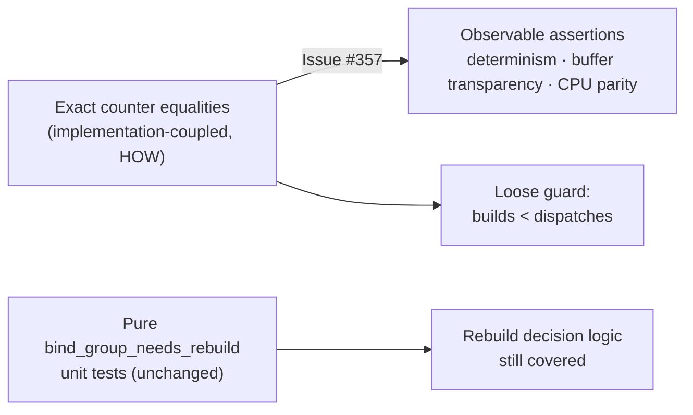

# PR Summary — Issue #357

## Summary

`rust_scorer/tests/gpu_bind_group_reuse.rs` asserted exact values of the
internal diagnostic counter `BatchedRunner::bind_group_builds` (`== 1` for
steady-state, `== 2` after buffer growth, `== 2` after shrink-back, `== 1` in
the parity test). Bind-group caching is a non-contractual internal optimisation
(Issue #322); those equalities pinned the *current* caching policy rather than
any behaviour a caller can observe, so a benign refactor of `BatchedRunner`'s
buffer management (per-binding bind groups, rebuild-on-shrink, buffer splitting)
would fail them with no behavioural regression.

This PR takes resolution **(a)** from the issue: rewrite the tests to assert
observable behaviour and replace the exact-count equalities with a loose
optimisation guard. The rebuild *decision logic* remains behaviour-tested by the
pure `bind_group_needs_rebuild` unit tests in
`src/gpu/forward_mse_batched.rs`, so no coverage is lost. The test-facing
`bind_group_builds` field is retained because it still backs the loose guard.

Fixes #357.

### What changed

| Test | Before (HOW) | After (WHAT) |
| --- | --- | --- |
| steady-state | `bind_group_builds == 1` | five identical dispatches return identical sums (determinism) + `bind_group_builds < dispatch_count` |
| growth/shrink | `== 1`, then `== 2`, then `== 2` | small chunk scores identically before/after growth; large chunk scores identically across shrink-and-regrow + `bind_group_builds < dispatch_count` |
| parity | CPU parity + `== 1` | CPU parity retained; exact equality replaced by `bind_group_builds < dispatch_count` |

The loose bound `bind_group_builds < dispatch_count` guards the optimisation
(catches a regression to per-dispatch rebuilds) without pinning the exact
policy — exactly the regression guard the issue suggests.



## Evidence

Backend/test-only change — no web interface to screenshot. The GPU tests run on
this machine (Metal adapter present, not skipped):

```text
running 3 tests
test reused_bind_group_preserves_cpu_parity ... ok
test same_size_chunks_are_deterministic_and_reuse_bind_groups ... ok
test grown_and_shrunk_chunks_stay_correct ... ok

test result: ok. 3 passed; 0 failed; 0 ignored; 0 measured; 0 filtered out
```

`./quality.sh` passes cleanly (fmt, clippy, check, build, test, doc, release).

## Test Plan

Modified `rust_scorer/tests/gpu_bind_group_reuse.rs`:

- `same_size_chunks_reuse_one_bind_group` → renamed
  `same_size_chunks_are_deterministic_and_reuse_bind_groups`: asserts five
  identical dispatches return identical sums, plus the loose reuse guard.
- `growing_chunk_forces_exactly_one_rebuild` → renamed
  `grown_and_shrunk_chunks_stay_correct`: asserts the small and large chunks each
  score identically across buffer growth and shrink-back, plus the loose guard.
- `reused_bind_group_preserves_cpu_parity`: CPU-parity assertions kept unchanged;
  the trailing exact `bind_group_builds == 1` replaced by the loose guard.

Note (per the "do not remove existing tests" rule): no test was deleted — two
tests were renamed to describe the behaviour they now assert, and their bodies
were reworked from exact-count checks to observable assertions. This is the
explicit intent of the `test-audit` issue.
