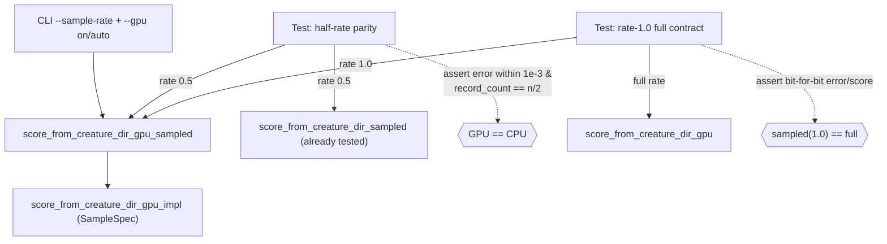

## Summary

Added direct test coverage for the public function
`score_from_creature_dir_gpu_sampled` (`rust_scorer/src/multi_score.rs`) — the
GPU directory-scoring path with record-level sub-sampling, invoked from the
production CLI (`src/main.rs`) whenever `--sample-rate` runs with the GPU
enabled. This combination previously had no test: the GPU parity tests only
drove the full-rate wrapper (`score_from_creature_dir_gpu`), while every
`--sample-rate` test ran with `--gpu off`. A refactor of the sampling plumbing
on the GPU path could therefore have silently changed production scores with
nothing to catch it. Closes #358.

The new `rust_scorer/tests/gpu_sample_rate_parity.rs` is behaviour-based (WHAT):
it asserts only observable results (per-creature `error`/`score`/`record_count`)
and never inspects internals. Both tests adapter-gate exactly like the existing
GPU suite, so CPU-only CI still passes cleanly.

## Evidence

Backend/CLI change — no web interface to screenshot. Verified by running the new
tests against a real Metal adapter on this Apple Silicon host (no skip note was
printed, so the GPU body executed for real):

```
running 2 tests
test gpu_sampled_matches_cpu_sampled_half_rate ... ok
test gpu_sampled_rate_one_matches_gpu_full ... ok

test result: ok. 2 passed; 0 failed; 0 ignored; 0 measured; 0 filtered out
```

`./quality.sh` passes end-to-end (fmt, cargo-deny, clippy, check, build, test,
rustdoc, release build): `✅ All quality checks passed!`



## Test Plan

Added `rust_scorer/tests/gpu_sample_rate_parity.rs` with two adapter-gated
tests:

- `gpu_sampled_matches_cpu_sampled_half_rate` — writes a 4-creature directory and
  a 4096-record corpus with a deterministic per-record pattern, scores it at
  `SampleSpec::new(0.5, 0)` on both the GPU sampled path and the already-tested
  CPU sampled path (`score_from_creature_dir_sampled`), and asserts each
  creature keeps exactly the stratified subsample (`n/2` records) and that the
  GPU `error` matches the CPU `error` within `1e-3` relative tolerance (f32 GPU
  vs f64 CPU accumulation).
- `gpu_sampled_rate_one_matches_gpu_full` — asserts the documented full-rate
  contract: `SampleSpec::new(1.0, 0)` reproduces the full-corpus GPU result
  (`score_from_creature_dir_gpu`) bit-for-bit for `error`, `score`, and
  `record_count`.

Both tests skip cleanly (with a stderr note) when no compatible GPU adapter is
present, matching the existing GPU parity suite, so CPU-only CI remains green.
No existing tests were modified or removed.
