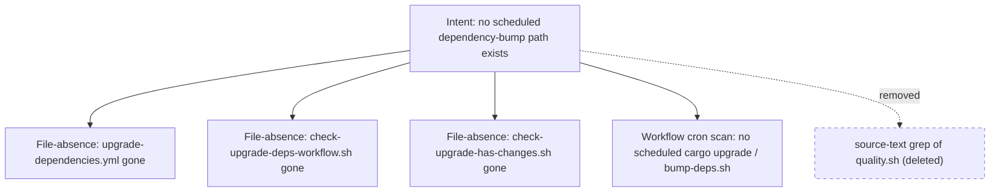

## Summary

Removed the sole source-text grep assertion from `tests/scripts/no_scheduled_dep_bump.bats`. Closes #359.

The deleted test (`"quality.sh no longer invokes the removed upgrade-deps validator"`)
ran `grep -F "check-upgrade-deps-workflow.sh" quality.sh` and asserted the string was
absent. This verified nothing about behaviour — only that an incidental string was missing
from `quality.sh`'s source. It was doubly weak:

- As an absence-grep it could not catch the guarded regression reintroduced under a
  different script name.
- It would false-fail if `quality.sh` ever mentioned the old name in a comment (e.g. a
  changelog note about the Issue #105 removal).

The observable (WHAT) intent — "no scheduled dependency-bump path exists" — is already
policed at the behavioural level by the remaining tests in the same file:

- File-absence checks (the validator helper `scripts/check-upgrade-deps-workflow.sh` and
  the manifest-change helper) — any attempt to re-wire the validator reappears here
  regardless of how `quality.sh` refers to it.
- The workflow cron scan that rejects any scheduled job naming `cargo upgrade` or
  `bump-deps.sh`.

Per the issue, option (a) (rewrite behaviourally) would only duplicate the existing
file-absence check at line 23, so the redundant grep was deleted (option b). An explanatory
comment was left in its place documenting why, so the removal is not mistaken for a
coverage gap.

## Evidence

Backend/CLI test-only change — no web interface to screenshot.

The affected suite passes after the change:

```
1..4
ok 1 the weekly upgrade-dependencies workflow does not exist
ok 2 the workflow validator helper for the removed schedule is gone
ok 3 the manifest-change helper for the removed schedule is gone
ok 4 no workflow under .github/workflows schedules a cargo dependency bump
```

The full `./quality.sh` gate passes cleanly (`✅ All quality checks passed!`).



## Test Plan

- Modified `tests/scripts/no_scheduled_dep_bump.bats`: deleted the source-text grep
  assertion (`quality.sh no longer invokes the removed upgrade-deps validator`); the
  behavioural checks in the same file continue to enforce the Issue #105 policy.
- Ran `bats tests/scripts/no_scheduled_dep_bump.bats < /dev/null` — 4 tests pass.
- Ran `./quality.sh < /dev/null` — all checks pass.
