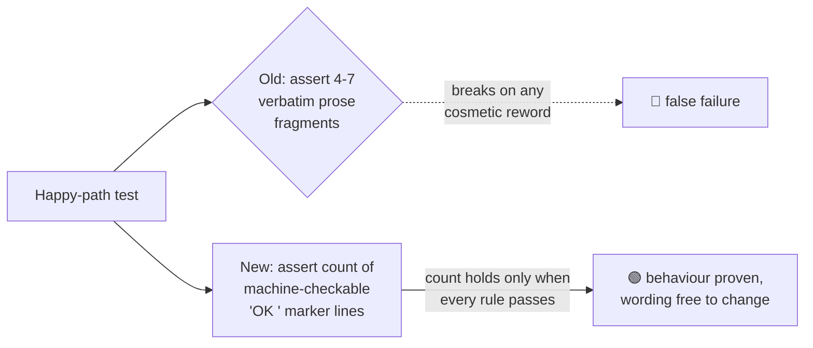

# PR Summary — Issue #360

## Summary

Replaced the verbatim informational success-message assertions in the happy-path
("passes on the canonical fixture") test of every checker-script BATS suite with a
single **machine-checkable marker count**. Each checker already emits one
`OK`-prefixed line (literally `OK` then three spaces) per rule it evaluates and passes; the happy-path tests now
assert the *number* of `OK`-prefixed lines rather than pinning the incidental prose of
each success message.

This resolves the audit finding (implementation-coupled assertions): a cosmetic
rewording of a success message — or a suite-wide style change such as adding an
`OK:` prefix or an emoji — no longer breaks dozens of tests with zero behavioural
regression. The assertion still proves **every rule ran and passed** (a behaviour
/ WHAT contract), because the exact `OK`-marker count only holds when each rule reached
its pass branch. The exit-status assertion (`[ "$status" -eq 0 ]`) remains the
primary contract, and the failure-path diagnostic assertions — a checker's genuine
contract — are untouched.

This is option (a) from the issue: assert a stable machine-checkable marker
(the `OK`-prefix already emitted by every checker via its shared `ok()` helper)
instead of prose. No checker script needed changing.

Closes #360.

## Approach

Per-suite expected `OK`-marker counts (verified by running each checker against its
canonical fixture):

| Suite | count | Suite | count |
| --- | --- | --- | --- |
| actionlint_workflow | 5 | semgrep_workflow | 7 |
| cargo_audit_workflow | 6 | security_policy | 5 |
| cargo_quality_workflow | 7 | workflow_concurrency | 3 |
| ci_permissions | 8 | workflow_job_graph | 15 |
| dependency_review_workflow | 4 | workflow_timeouts | 3 |
| gitleaks_workflow | 9 | prebuilt_tool_install | 2 |
| markdown_lint_workflow | 7 | workflow_action_versions | 8 |
| rust_lints | 5 | rust_toolchain | 3 |
| sbom_workflow | 6 | | |

### Note on `workflow_action_versions.bats`

The cosmetic positive fragments (`actions/checkout@<SHA>`, `SHA-pinned`,
`>= v5, SHA-pinned`) were replaced by the `OK`-marker count, but the negative guard
`[[ "$output" != *"Node 20 exception, tracked"* ]]` was **retained**. That
assertion is a genuine behavioural regression guard from Issue #136 (no action may
regress onto the tracked Node 20 exception path — a compliant action still emits an
`OK`-marker line, so the count alone would not catch it), not mere success-message
wording. Its explanatory comment was updated accordingly.

`security_policy.bats` likewise keeps its existing `[[ "$output" != *"FAIL"* ]]`
assertion alongside the new count.

## Evidence

Backend/CLI (shell test) change only — no web interface to screenshot.

- Verified the new assertion is **non-vacuous**: temporarily asserting a wrong
  count (`-eq 99`) made `rust_toolchain.bats` "passes on the canonical fixture"
  fail; restoring the correct count (`-eq 3`) made it pass again.
- Full BATS suite (`bats tests/scripts`): **317 tests, 0 failures**.
- `./scripts/spell-check.sh`: no typos found.

## Test Plan

- Modified the happy-path test in each of the 17 flagged suites under
  `tests/scripts/` to assert the `OK`-marker count instead of verbatim prose:
  `actionlint_workflow`, `cargo_audit_workflow`, `cargo_quality_workflow`,
  `ci_permissions`, `dependency_review_workflow`, `gitleaks_workflow`,
  `markdown_lint_workflow`, `rust_lints`, `rust_toolchain`, `sbom_workflow`,
  `semgrep_workflow`, `security_policy`, `workflow_concurrency`,
  `workflow_job_graph`, `workflow_timeouts`, `prebuilt_tool_install`,
  `workflow_action_versions`.
- No checker scripts changed; no tests removed or commented out (prose *positive*
  fragments replaced by an equivalent, stronger behavioural assertion; genuine
  negative/failure-path assertions retained).
- Ran the full `tests/scripts` BATS suite (317 tests) — all pass.
