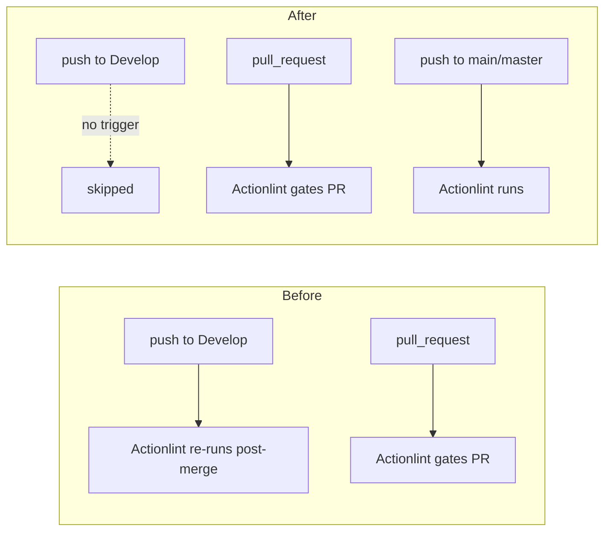

# PR Summary — Issue #369

## Summary

The standalone **Actionlint** lint gate (`.github/workflows/actionlint.yml`)
still triggered on `push` to the default branch `Develop`. actionlint is a
checker — it should gate the pull request, not re-run post-merge. The
push-to-`Develop` trigger duplicated the run that already gated the PR, wasting
CI minutes and risking a stray red tick on `Develop` for a check that already
passed.

This PR narrows the `push:` branch filter to non-default branches
(`[main, master]`), dropping `Develop`, and keeps the `pull_request` and
`workflow_dispatch` triggers intact so every change is still linted before
merge. A new validation rule in `scripts/check-actionlint-workflow.sh` (rule 7)
enforces the invariant so the regression cannot silently return.

Closes #369.

## Change type

Backend/CI configuration — no web interface to screenshot. Verified via the
shell validator and its BATS suite (see Test Plan).

## What changed

- `.github/workflows/actionlint.yml` — `push.branches` narrowed from
  `[main, master, Develop]` to `[main, master]`; added a comment explaining why
  a lint gate must not re-run on push to the default branch.
- `scripts/check-actionlint-workflow.sh` — added **rule 7**: fail if any
  `branches:` filter lists the default branch `Develop` (only the push filter
  ever does).
- `tests/scripts/actionlint_workflow.bats` — updated the canonical fixture to
  the fixed push filter, bumped the `OK` marker count to 7, and added a
  regression test that re-introduces the push-to-`Develop` trigger and asserts
  the validator fails.

## Trigger behaviour — before vs after



## Evidence

Validator against the real workflow — rule 7 now reported:

```text
OK   .../actionlint.yml: does not re-trigger on push to the default branch Develop
```

`actionlint` and `shellcheck` both pass on the modified files.

## Test Plan

- `tests/scripts/actionlint_workflow.bats` — all 12 tests pass, including the
  new `fails when the push trigger re-runs on the default branch Develop`
  regression test (fails against the pre-fix filter, passes after the fix).
- `scripts/check-actionlint-workflow.sh` exits 0 against the real workflow with
  7 `OK` markers.
- `shellcheck scripts/check-actionlint-workflow.sh` — clean.
- `actionlint .github/workflows/actionlint.yml` — clean.
- `./quality.sh` — full local gate.
