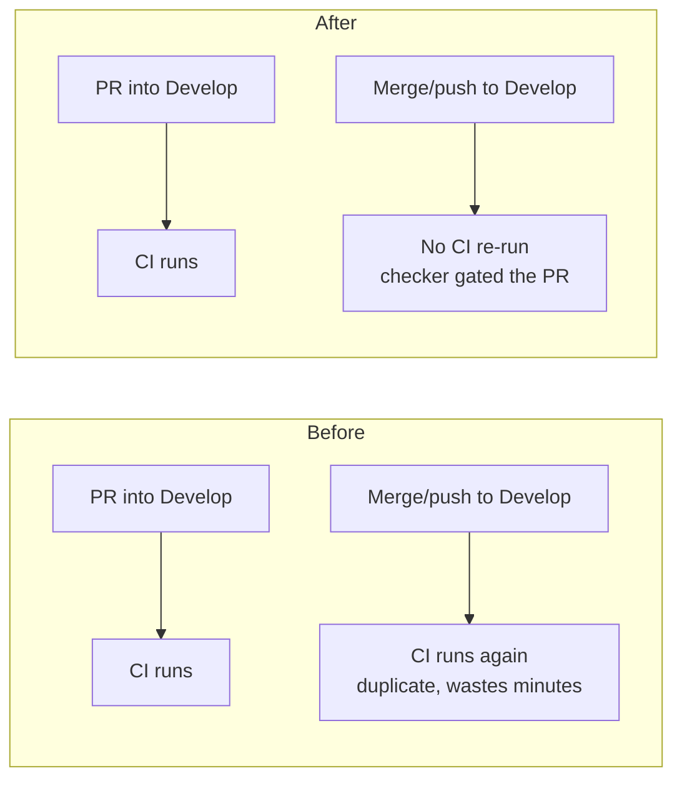

# Drop push-to-`Develop` trigger from the CI checker workflow (Issue #370)

## Summary

`.github/workflows/ci.yml` runs the heavy test/lint/scan gate. As a **checker**
it should gate the pull request, not re-run post-merge. It still triggered on
`push:` to the default branch `Develop`, so every merge into `Develop`
re-ran the full build — a duplicate of the run that already gated the PR. That
duplicate post-merge run wastes CI minutes and can leave a red tick on the
default branch for a check that already passed on the PR.

The fix removes the `push:` block from the workflow's `on:` trigger (it targeted
only `Develop`), leaving `pull_request` and `workflow_dispatch`. The legitimate
`pull_request` filter on `Develop`/`milestone/*` is untouched, so PRs into the
default and milestone branches are still gated. Deploy/publish/release workflows
are different and must keep firing on push — this change is scoped to the CI
checker only.

A purpose-built guard, `scripts/check-ci-push-trigger.sh` (wired into
`quality.sh`), fails loudly if a push-to-`Develop` trigger is ever re-added,
while deliberately ignoring the `pull_request` filter's legitimate `Develop`
entry.

Closes #370.

## Change of behaviour



## Evidence

Backend/CI-config change — no web interface to screenshot. Verified via the new
validator and BATS suite (TDD: the repo-workflow test failed before the fix and
passes after).

Validator against the fixed workflow:

```text
OK   .github/workflows/ci.yml: no push trigger — the checker gates the PR, not push to Develop
```

## Test Plan

- Added `scripts/check-ci-push-trigger.sh` — scopes strictly to the `on.push`
  trigger and fails only when the push branch filter lists `Develop`.
- Added `tests/scripts/ci_push_trigger.bats` covering:
  - passes when there is no push trigger (checker gates the PR only);
  - fails when the push trigger targets `Develop` (block form and inline-list
    form);
  - passes when push targets only non-default branches (`main`, `master`);
  - does not confuse the legitimate `pull_request` `Develop` filter for a push
    trigger;
  - missing-file / unknown-flag error paths;
  - the real repository `ci.yml` no longer re-triggers on push to `Develop`
    (regression test — red before the fix, green after).
- Wired the validator into `quality.sh` and added a `CHANGELOG.md` entry.
