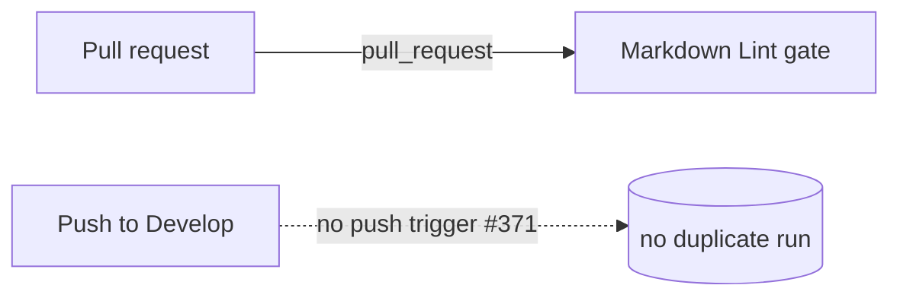

# PR Summary — Issue #371

## Summary

The Markdown Lint workflow (`.github/workflows/markdown-lint.yml`) is a
lint/checker workflow, but it still triggered on `push` to the default branch
`Develop` (via `branches: [main, master, Develop]`). Once it becomes a required
status check, every merge into `Develop` re-ran a check that had already gated
the pull request — wasting CI minutes and risking a red tick on the default
branch for a check that already passed.

This PR removes the `push:` trigger entirely so the workflow gates the pull
request only, and updates the per-repo validator + tests + docs to enforce and
describe the new policy. This deliberately reverses the Issue #207 push→Develop
policy for this checker (deploy/publish workflows still fire on push; a checker
does not). `Closes #371`.

## Changes

- **`.github/workflows/markdown-lint.yml`** — dropped the `push:` trigger,
  keeping `pull_request`. Replaced the Issue #207 comment with an Issue #371
  explanation of why a checker has no `push:` trigger.
- **`scripts/check-markdown-lint-workflow.sh`** — inverted rule 6. It now
  **fails** when a `push:` trigger reaches the default branch `Develop` (or is
  unfiltered) and **passes** when there is no `push:` trigger or its branches
  list excludes `Develop`.
- **`tests/scripts/markdown_lint_workflow.bats`** — canonical fixture no longer
  carries a `push:` trigger. Replaced the Issue #207 "must target Develop" test
  with three Issue #371 tests: push→Develop fails, push excluding Develop
  passes, and an unfiltered push fails. Documented the business-logic reversal
  inline.
- **`README.md`** — corrected the Markdown Lint description (PR-gated only, no
  `push:` trigger).

## Trigger policy

## Evidence

Backend/CI-config change — no web interface to screenshot. Verified via the
per-repo validator and the BATS suite:

- `scripts/check-markdown-lint-workflow.sh` against the real workflow prints 7
  `OK` markers and exits 0, including
  `no push trigger — the lint workflow gates the PR only (Issue #371)`.
- `bats tests/scripts/markdown_lint_workflow.bats` — 14/14 pass.
- `shellcheck scripts/check-markdown-lint-workflow.sh` — clean.
- `markdownlint-cli2` — 0 errors.

## Test Plan

- `tests/scripts/markdown_lint_workflow.bats`:
  - `fails when the push trigger targets the default branch Develop (Issue #371)`
  - `passes when a push trigger excludes the default branch Develop (Issue #371)`
  - `fails when the push trigger has no branches filter (Issue #371)`
  - `passes on the canonical fixture` (updated fixture, still 7 `OK` markers)
  - all pre-existing rule tests continue to pass.
