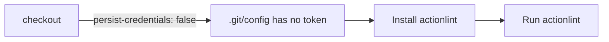

# Harden `actionlint` checkout — disable credential persistence

## Summary

The `actionlint` workflow's `actions/checkout` step ran without
`persist-credentials: false`, so `actions/checkout` wrote the workflow
`GITHUB_TOKEN` into `.git/config` as an auth header. Any later step in the job
(including a compromised dependency or an injected script) could read it and act
as the token. This job only reads the tree to lint workflow YAML — it never
pushes back or fetches a private submodule — so the persisted credential is
unnecessary and only widens the blast radius of a compromised step.

Added `persist-credentials: false` to the checkout step, matching the
established pattern already used across `ci.yml`, `security.yml`, `semgrep.yml`,
`sbom.yml`, `markdown-lint.yml`, and `dependency-review.yml`.

Closes #372.

## Evidence

Backend/CI-only change — no web interface to screenshot. Verified with the
repository's own workflow validators:

- `actionlint .github/workflows/actionlint.yml` — clean.
- `scripts/check-persist-credentials.sh --workflow .github/workflows/actionlint.yml`
  →
  `OK   .github/workflows/actionlint.yml: checkout at line 58 sets persist-credentials: false`
- `scripts/check-actionlint-workflow.sh` — all structural checks pass
  (triggers, least-privilege permissions, SHA-pinned checkout, milestone branch
  filter, no push-to-default-branch trigger).

## Test Plan

- `scripts/check-persist-credentials.sh --workflow .github/workflows/actionlint.yml`
  now reports the checkout step disables credential persistence (previously it
  would fail this rule for the file).
- `actionlint` and `scripts/check-actionlint-workflow.sh` confirm the workflow
  remains structurally valid after the edit.
