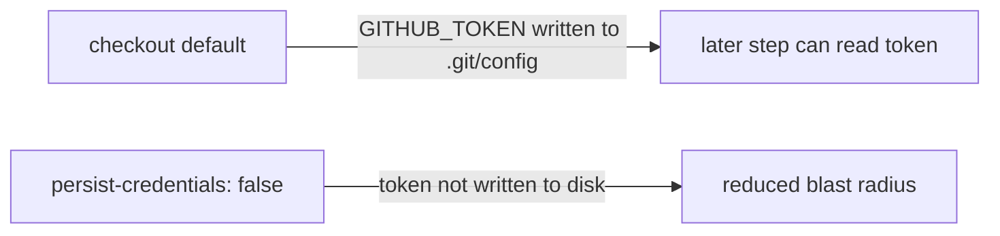

## Summary

The `audit` job in `.github/workflows/cargo-audit.yml` ran `actions/checkout`
with credential persistence left on (the default). By default checkout writes
the workflow `GITHUB_TOKEN` into `.git/config` as an auth header, where any
later step in the job — including a compromised dependency — can read it. The
`audit` job is read-only: it only runs `cargo audit` and never pushes back to
the repository nor fetches private submodules, so it does not need the persisted
credential.

This PR adds `persist-credentials: false` to the checkout step so the token is
no longer written to disk, narrowing the blast radius of a compromised step.
Mirrors the identical fix applied to the actionlint workflow in Issue #372.

Closes #373.

## Evidence

Backend/CI-only change — no web interface to screenshot. Verified with:

- `actionlint .github/workflows/cargo-audit.yml` — passes cleanly.
- YAML parse check (`yaml.safe_load`) — valid.

## Test Plan

- `actionlint` on the modified workflow to confirm the step remains valid.
- No Rust code changed, so no new unit tests are applicable; the change is a
  GitHub Actions security hardening on the checkout step.
