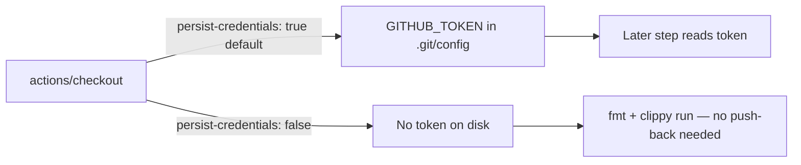

## Summary

Job `quality` in `.github/workflows/cargo-quality.yml` checked out the repo with
`actions/checkout` but did not disable credential persistence. By default
`actions/checkout` writes the workflow's `GITHUB_TOKEN` into `.git/config` as an
auth header, where any later step in the job — including a compromised
dependency or an injected script — can read it and act as the token. This job
only runs `cargo fmt --check` and `cargo clippy`; it never pushes back to the
repository nor fetches a private submodule, so the persisted credential is pure
blast radius.

This PR adds `persist-credentials: false` to the checkout step and extends the
`check-persist-credentials.sh` guarded-workflow list so `cargo-quality.yml` is
now enforced alongside `security.yml` and `semgrep.yml`, preventing regression.

Closes #374.

## Change detail

- `.github/workflows/cargo-quality.yml` — checkout step now sets
  `persist-credentials: false` (with an explanatory comment).
- `scripts/check-persist-credentials.sh` — `cargo-quality.yml` added to the
  default guarded-workflow set (plus header/usage text).
- `tests/scripts/persist_credentials.bats` — new real-repo assertion for
  `cargo-quality.yml` and the default-run coverage test updated to expect it.

## Evidence

Backend/CI change — no web interface to screenshot. Verified via the
credential-persistence validator and BATS suite:

- `./scripts/check-persist-credentials.sh` now reports
  `OK ... cargo-quality.yml: checkout at line 52 sets persist-credentials: false`.
- `./scripts/check-cargo-quality-workflow.sh` still passes all rules.

## Test Plan

- Added `tests/scripts/persist_credentials.bats::real repository
  cargo-quality.yml disables credential persistence (Issue #374)` — reproduces
  the finding (fails before the fix, passes after).
- Updated `tests/scripts/persist_credentials.bats::default run validates every
  guarded workflow` to assert `cargo-quality.yml` is now covered.
- Full `bats tests/scripts/persist_credentials.bats` suite passes (11 tests).
