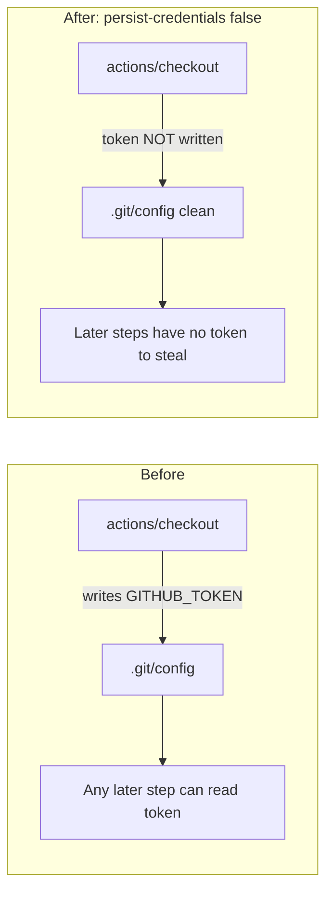

# Disable credential persistence for the `quality` checkout (Issue #376)

## Summary

The `quality` job in `.github/workflows/ci.yml` checked out with
`actions/checkout` (`fetch-depth: 0`) but did **not** set
`persist-credentials: false`. By default `actions/checkout` writes the
workflow's `GITHUB_TOKEN` into `.git/config` as an auth header, where any later
step in the job — a compromised dependency or an injected script — can read it
and act as the token. The `quality` job only reads the tree (fmt / clippy /
build / test / doc / release) and never pushes back or fetches a private
submodule, so the persisted credential is pure blast radius.

The fix adds `persist-credentials: false` to the `quality` job's "Checkout
code" step so the token is never written to disk, matching the already-hardened
`validation` and `spell-check` checkouts in the same workflow.

Closes #376

## Evidence

This is a CI-workflow / shell change with no web interface, so evidence is the
regression test plus the workflow validators.

Before the fix, the credential-persistence check reported the `quality`
checkout as unprotected:

```
FAIL .github/workflows/ci.yml: checkout at line 77 must set 'persist-credentials: false' ...
```

After the fix, the new BATS regression test passes and `actionlint` is clean:

```
ok 18 quality self checkout sets persist-credentials: false
ok 19 parser reports 'no' when the disable flag is absent (guards the assertion)
actionlint OK
```

### Token blast-radius before vs after



## Test Plan

- Added `tests/scripts/persist_credentials_quality.bats`, which parses the
  shipped `.github/workflows/ci.yml`, isolates the `quality:` job's self
  checkout (the `actions/checkout` step with no `repository:` override), and
  asserts it sets `persist-credentials: false`. The test fails against the
  unfixed workflow and passes after the fix; a second guard case confirms the
  parser reports `no` when the flag is absent, so the assertion cannot silently
  pass.
- Full `./quality.sh` shell/workflow gate passes: shellcheck,
  `check-persist-credentials.sh` (default guarded set unchanged),
  `check-ci-permissions.sh`, workflow timeout / concurrency / job-graph
  validators, README-CI alignment, codespell, and all BATS suites (382 tests),
  plus `actionlint .github/workflows/ci.yml`.

## Scope note

Only the `quality` job's checkout was changed. The `shell-checks` self checkout
(ci.yml:255) is a separate finding tracked under its own issue and is
intentionally left untouched here.
