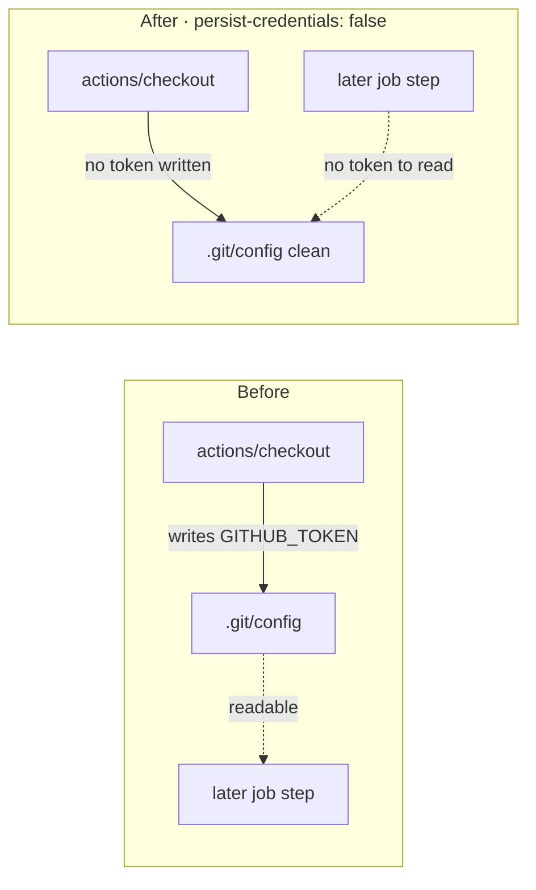

# Disable credential persistence for the `shell-checks` checkout

## Summary

The `shell-checks` job in `.github/workflows/ci.yml` ran its main repository
`actions/checkout` without `persist-credentials: false`. By default checkout
writes the workflow `GITHUB_TOKEN` into `.git/config` as an auth header, where
any later step in the job — a compromised dependency or an injected script — can
read it and act as the token. The job only reads the tree (`bash -n`,
ShellCheck, bats) and never pushes back or fetches a private submodule, so the
persisted credential is pure blast radius.

This mirrors the fix already applied to the sibling `build`, `validation` and
`spell-check` jobs (Issues #376, #381, #380). `Closes #378.`

Changes:

- **`.github/workflows/ci.yml`** — add `persist-credentials: false` to the
  `shell-checks` checkout step, keeping the token off disk for this read-only job.
- **`scripts/check-persist-credentials.sh`** — add `ci.yml` to the default
  guarded-workflow set so the local gate (`quality.sh`) and CI enforce that
  every `ci.yml` checkout disables credential persistence, preventing regression.
- **`tests/scripts/persist_credentials.bats`** — regression tests.

## Evidence

Backend/CI-only change — no web interface to screenshot.

Validator now passes against `ci.yml` (previously failed at line 258):

```
OK   .github/workflows/ci.yml: checkout at line 77 sets persist-credentials: false
OK   .github/workflows/ci.yml: checkout at line 193 sets persist-credentials: false
OK   .github/workflows/ci.yml: checkout at line 258 sets persist-credentials: false
OK   .github/workflows/ci.yml: checkout at line 327 sets persist-credentials: false
```

Blast-radius reduction:



## Test Plan

Added to `tests/scripts/persist_credentials.bats`:

- `real repository ci.yml disables credential persistence everywhere (Issue #378)`
  — asserts the validator passes against the shipped `ci.yml`.
- Extended `default run validates every guarded workflow ...` to require the
  `ci.yml` line in the default-set output.

Verified TDD RED→GREEN: before the fix the validator failed at `ci.yml:258`;
after the fix all four checkouts report `persist-credentials: false`. Full
`bats tests/scripts` suite passes for the changed suites (16/16 across
`persist_credentials.bats` and `persist_credentials_shell_checks.bats`).

Note: an unrelated, pre-existing flaky test
(`markdown_lint_workflow.bats` — "gates milestone PRs") intermittently fails in
full-suite runs on the base branch and passes in isolation; it is untouched by
this change.
