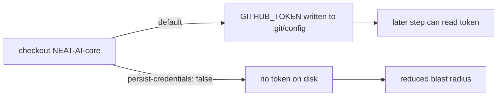

# PR Summary — Issue #379

## Summary

The `shell-checks` job in `.github/workflows/ci.yml` checked out the
`stSoftwareAU/NEAT-AI-core` path dependency (line 267) with `actions/checkout`
but **without** `persist-credentials: false`. By default checkout writes the
workflow `GITHUB_TOKEN` into `.git/config` as an auth header, where any later
step in the job — including a compromised dependency or injected script — could
read it and act as the token. The `shell-checks` job only reads the tree
(bash syntax check, ShellCheck, bats) and never pushes back to a repository or
fetches a private submodule, so the persisted credential is unnecessary and
only widens the blast radius of a compromised step.

This PR adds `persist-credentials: false` to that checkout so the token is not
written to disk, and adds a bats regression test that asserts the property
against the shipped `ci.yml`. Scope is limited to this one checkout step
(finding `BP-PERSIST-CREDS-ci-shell-checks-1`); the sibling `shell-checks`
checkout at line 261 is owned by Issue #378 and is intentionally untouched.

Closes #379.

## Evidence

This is a CI/workflow-hardening change with no web interface to screenshot.
Verification is via the new bats test and the existing workflow validators.



Before → after (the added checkout input):

```yaml
      - name: Checkout NEAT-AI-core (path dependency for neat-core)
        uses: actions/checkout@93cb6efe18208431cddfb8368fd83d5badbf9bfd  # v5
        with:
          repository: stSoftwareAU/NEAT-AI-core
          ref: Develop
          path: NEAT-AI-core
          persist-credentials: false   # added
```

- New test (red before the fix, green after):
  `tests/scripts/persist_credentials_shell_checks.bats`.
- `actionlint .github/workflows/ci.yml` — clean.
- Existing workflow validators still pass: `check-workflow-paths.sh`,
  `check-ci-permissions.sh`, `check-ci-job-graph.sh`,
  `check-readme-ci-alignment.sh`, `check-actionlint-workflow.sh`.
- Full `bats tests/scripts` suite passes (exit 0).

## Test Plan

- Added `tests/scripts/persist_credentials_shell_checks.bats`:
  - `shell-checks NEAT-AI-core checkout sets persist-credentials: false` —
    parses the real `ci.yml`, isolates the `shell-checks` job, locates the
    checkout step targeting `stSoftwareAU/NEAT-AI-core`, and asserts it sets
    `persist-credentials: false`. This test fails against the pre-fix workflow
    and passes after the change.
  - `parser reports 'no' when the disable flag is absent` — guards the
    assertion by proving the parser returns `no` on a synthetic workflow whose
    NEAT-AI-core checkout omits the flag.
