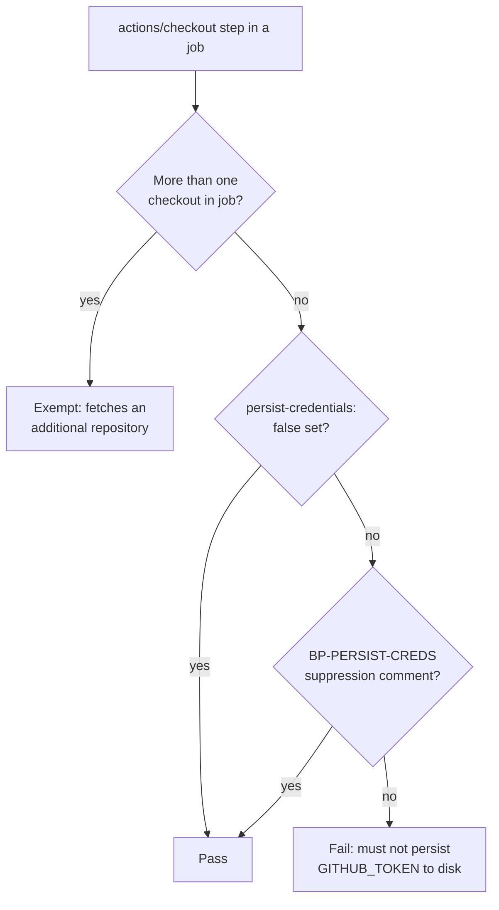

# PR Summary — Issue #380

## Summary

The `spell-check` job in `.github/workflows/ci.yml` ran `actions/checkout`
without `persist-credentials: false`. By default checkout writes the workflow's
`GITHUB_TOKEN` into `.git/config` as an auth header, where any later step in the
job — including a compromised dependency or injected script — can read it and
act as the token. The spell-check job only reads the tree (it never pushes back
or fetches a private submodule), so it does not need the persisted credential.

This PR hardens that checkout and adds a validator plus tests so the regression
cannot silently return. **Closes #380.**

Changes:

- **`.github/workflows/ci.yml`** — added `persist-credentials: false` (with an
  explanatory comment) to the `spell-check` job's checkout step.
- **`scripts/check-persist-credentials.sh`** — new validator. A job whose only
  `actions/checkout` is a single checkout of the current repository must set
  `persist-credentials: false`; a job that runs more than one checkout (it
  fetches an additional repository, e.g. the NEAT-AI-core sibling clone) is
  exempt; a single-checkout job may opt out with a documented
  `# best-practice-ignore: BP-PERSIST-CREDS <reason>` comment.
- **`quality.sh`** — wired the validator into the local gate alongside the other
  workflow-hardening checks.
- **`tests/scripts/persist_credentials.bats`** — BATS coverage for the
  validator (happy path, exemptions, failures, suppression, real `ci.yml`).

### Scope note

This issue targets the `spell-check` checkout in `ci.yml` only. Sibling
workflows carry their own separate `BP-PERSIST-CREDS` audit findings, so the
validator defaults to `ci.yml` — broadening the gate to every workflow is
deferred until those siblings land, so an unfixed sibling cannot fail this
check. The script still validates any file passed via `--workflow`.

## Evidence

Backend/CI change — no web interface to screenshot. Verified via the validator
and the BATS suite.

Validator against the real `ci.yml` (after the fix):

```
OK   ci.yml: job 'quality' runs 2 checkouts (fetches an additional repository) — exempt
OK   ci.yml: job 'validation' runs 2 checkouts (fetches an additional repository) — exempt
OK   ci.yml: job 'shell-checks' runs 2 checkouts (fetches an additional repository) — exempt
OK   ci.yml: job 'spell-check' single checkout sets persist-credentials: false
OK   ci.yml: job 'ci-required' has no checkout step
```

Rule flow:



## Test Plan

- Added `tests/scripts/persist_credentials.bats`:
  - `passes when a single-checkout job sets persist-credentials: false`
  - `exempts a job that runs more than one checkout`
  - `fails when a single-checkout job omits persist-credentials: false`
    (reproduces the pre-fix state — fails against the unfixed `ci.yml`)
  - `fails when persist-credentials is set to true`
  - `accepts a documented BP-PERSIST-CREDS suppression on a single-checkout job`
  - `reports OK for a job with no checkout step`
  - error/usage paths and `real repository ci.yml satisfies the persist-credentials rule`
- `shellcheck -s bash scripts/check-persist-credentials.sh` — clean.
- `actionlint .github/workflows/ci.yml` — clean.
- `./scripts/spell-check.sh` — no typos.
