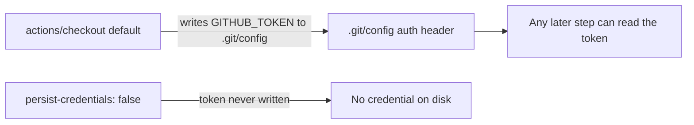

## Summary

Hardened the `validation` job in `.github/workflows/ci.yml` so its
`actions/checkout` steps no longer persist the workflow `GITHUB_TOKEN` on disk.
By default `actions/checkout` writes the token into `.git/config` as an auth
header, where any later step in the job — including a compromised dependency or
an injected script — can read it and act as the token. The `validation` job only
reads the tree (required-file check + `cargo metadata`) and never pushes back to
the repository, so it does not need the persisted credential. Added
`persist-credentials: false` to both the primary self-checkout and the
NEAT-AI-core path-dependency checkout, mirroring the fix applied to `shell-checks`
in Issue #379.

Closes #381.

## Evidence

Backend/CI-only change — there is no web interface to screenshot.

The idle-task finding (`BP-PERSIST-CREDS-ci-validation-0`) targeted
`.github/workflows/ci.yml`:191, the `validation` job's step 0 checkout.

Verified with the persist-credentials validator and the new regression test:

- `./scripts/check-persist-credentials.sh` — passes.
- `bats tests/scripts/persist_credentials_validation.bats` — the new test
  asserts, against the shipped `ci.yml`, that the `validation` job's self
  checkout sets `persist-credentials: false`.

## Test Plan

- Added `tests/scripts/persist_credentials_validation.bats`:
  - `validation self checkout sets persist-credentials: false` — parses the real
    `ci.yml`, isolates the `validation:` job, and asserts the self checkout
    disables credential persistence (reproduces the finding; fails against the
    unfixed workflow).
  - `parser reports 'no' when the disable flag is absent` — guards the assertion
    against a false positive.
- Existing `tests/scripts/persist_credentials*.bats` continue to pass.
- `./quality.sh` run locally.
