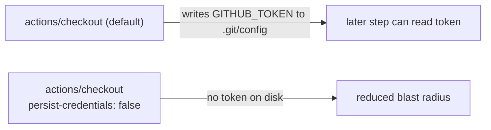

# Harden `dependency-review` checkout — `persist-credentials: false` (Issue #383)

## Summary

The standalone `dependency-review` workflow's `actions/checkout` step ran with
`actions/checkout`'s default `persist-credentials: true`, which writes the
workflow `GITHUB_TOKEN` into `.git/config` as an auth header. The job only diffs
the PR manifest against the base branch and never pushes back to the repository
or fetches a private submodule, so the persisted credential is unnecessary and
only widens the blast radius of a compromised step.

This PR adds `persist-credentials: false` to that checkout step (mirroring the
already-hardened `ci.yml` jobs, Issue #381) and extends the
`check-persist-credentials.sh` gate's default set to include
`dependency-review.yml` so the hardening cannot silently regress.

Closes #383.

## Changes

- `.github/workflows/dependency-review.yml` — add `persist-credentials: false`
  to the checkout step with an explanatory comment.
- `scripts/check-persist-credentials.sh` — add `dependency-review.yml` to the
  default workflow set now that its checkout is hardened; update header/usage
  docs.
- `tests/scripts/persist_credentials.bats` — add a regression test asserting the
  real `dependency-review.yml` sets `persist-credentials: false`, and broaden
  the default-set assertion.

## Evidence

Backend/CI-config change only — no web interface to screenshot. Verified via the
repository's own gate and the bats suite:

```
$ ./scripts/check-persist-credentials.sh
OK   .../dependency-review.yml: job 'dependency-review' single checkout sets persist-credentials: false
exit=0

$ bats tests/scripts/persist_credentials.bats
1..10
ok 10 real repository dependency-review.yml hardens its single checkout (Issue #383)
```

`shellcheck`, `actionlint`, and `check-dependency-review-workflow.sh` all pass.



## Test Plan

- `tests/scripts/persist_credentials.bats` — new test `real repository
  dependency-review.yml hardens its single checkout (Issue #383)` reproduces the
  finding (would fail against the unhardened workflow) and passes after the fix.
- Existing `persist_credentials.bats` suite (10 tests) passes.
- `./scripts/check-persist-credentials.sh` now validates both `ci.yml` and
  `dependency-review.yml` and exits 0.
