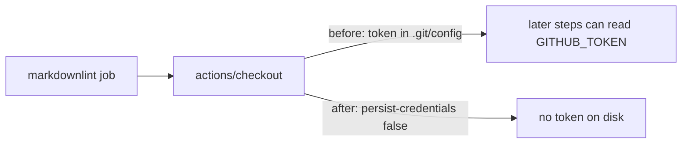

# Harden markdownlint checkout with `persist-credentials: false` (Issue #384)

## Summary

The `markdownlint` job in `.github/workflows/markdown-lint.yml` ran its single
`actions/checkout` without `persist-credentials: false`. By default checkout
writes the workflow `GITHUB_TOKEN` into `.git/config` as an auth header, where
any later step in the job — a compromised dependency or an injected script —
could read it and act as the token. The job only reads the tree to lint
markdown and never pushes back to the repository nor fetches a private
submodule, so it does not need the persisted credential; keeping it on disk
only widened the blast radius of a compromised step.

This change sets `persist-credentials: false` on that checkout, mirroring the
hardening already applied across `ci.yml` and `dependency-review.yml`. It also
extends the `check-persist-credentials.sh` default validation set to cover
`markdown-lint.yml` (following the Issue #383 precedent), so the shipped
workflow and the enforced rule cannot drift apart.

Closes #384.

## Change flow

## Evidence

Backend/CI change only — no web interface to screenshot. Verified via the shell
validators and the bats suite:

- `scripts/check-persist-credentials.sh` (default set) now reports
  `job 'markdownlint' single checkout sets persist-credentials: false`.
- `scripts/check-markdown-lint-workflow.sh` still passes every rule for the
  edited workflow.
- `scripts/check-workflow-action-versions.sh` confirms both `uses:` lines stay
  SHA-pinned after the edit.
- Full `bats tests/scripts` run: 332 tests pass.

## Test Plan

- Added `tests/scripts/persist_credentials.bats::real repository markdown-lint.yml
  hardens its single checkout (Issue #384)` — asserts the real workflow's single
  checkout sets `persist-credentials: false`. This test fails against the
  unhardened workflow and passes after the fix.
- Existing `persist_credentials.bats` and `markdown_lint_workflow.bats` suites
  continue to pass unchanged.
