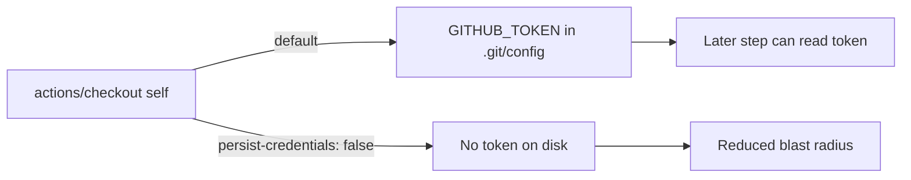

# PR Summary — Issue #385

## Summary

The `sbom` job's checkout of the current repository ran `actions/checkout`
without `persist-credentials: false`, so the action wrote the workflow
`GITHUB_TOKEN` into `.git/config` as an auth header. Any later step in the job —
including a compromised dependency or an injected script — could read it and act
as the token. This job only reads the checked-out code to build the CycloneDX
SBOM and never pushes back, so the persisted credential is unnecessary blast
radius.

This PR adds `persist-credentials: false` to the self checkout in
`.github/workflows/sbom.yml`, and hardens the per-repo gate so the fix cannot
silently regress. **Closes #385.**

Scope note: the second checkout in the job fetches a *different* repository
(`stSoftwareAU/NEAT-AI-core`, identified by its `repository:` input) and
legitimately needs a credential to fetch, so it remains exempt.

## Changes

- **`.github/workflows/sbom.yml`** — added `persist-credentials: false` to the
  current-repo (self) checkout step.
- **`scripts/check-sbom-workflow.sh`** — added rule 7: the self checkout (a
  checkout with no `repository:` input) must set `persist-credentials: false`.
  A cross-repo checkout (one carrying `repository:`) stays exempt because it
  needs a credential to fetch a different repo.
- **`tests/scripts/sbom_workflow.bats`** — added the `persist-credentials: false`
  line to the canonical fixture, bumped the OK-marker count 6 → 7, and added two
  behavioural tests: one asserting the validator fails when the self checkout
  omits the setting, and one asserting the cross-repo checkout stays exempt.

## Why this is the right layer

The dedicated `check-persist-credentials.sh` gate exempts *any* job with more
than one checkout (a multi-checkout job is treated as a static sign a credential
is needed). That coarse heuristic left this specific self checkout unguarded, so
the regression protection lives in the sbom-specific validator instead, keeping
the change scoped to this one workflow.

## Evidence

Backend/CI-config change — no web interface to screenshot. Verified via the
per-repo gates and the bats suite:

- **Regression test fails against the unfixed workflow** — stripping
  `persist-credentials: false` from the self checkout makes rule 7 fail with
  `self checkout of the current repo must set 'persist-credentials: false'
  (Issue #385)` (exit 1).
- **Validator passes on the fixed workflow** — `./scripts/check-sbom-workflow.sh`
  reports 7 OK markers, exit 0.
- **`./scripts/check-persist-credentials.sh`** — passes (exit 0); the sbom job
  stays exempt under the shared gate, unchanged.
- **`./quality.sh`** — passes cleanly (exit 0), including actionlint and the full
  bats + Rust test suites.

## Test Plan

- `tests/scripts/sbom_workflow.bats::fails when the self checkout does not set persist-credentials: false`
  — reproduces the unfixed state and asserts the validator rejects it.
- `tests/scripts/sbom_workflow.bats::passes when only the cross-repo checkout omits persist-credentials`
  — asserts the cross-repo (`repository:`) checkout stays exempt.
- `tests/scripts/sbom_workflow.bats::passes on the canonical fixture` — updated
  to expect 7 OK markers.
- `tests/scripts/sbom_workflow.bats::real repository SBOM workflow satisfies every rule`
  — the real `sbom.yml` now satisfies the new rule.
