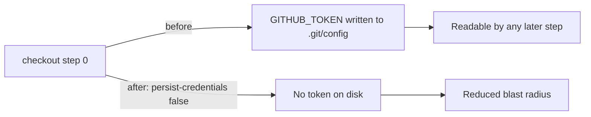

# PR Summary — Issue #387

## Summary

Job `security` in `.github/workflows/security.yml` ran `actions/checkout`
(step 0) without `persist-credentials: false`. By default `actions/checkout`
writes the workflow's `GITHUB_TOKEN` into `.git/config` as an auth header,
where any later step in the job — including a compromised dependency or an
injected script — can read it and act as the token.

The `security` job only runs `cargo audit` and the dependency-review action;
no later step pushes back to the repository or fetches a private submodule
with that credential, so the persisted token is unnecessary and only widens
the blast radius of a compromised step. This change adds
`persist-credentials: false` to the checkout step so the token is not written
to disk — matching the pattern already used across the other workflows in
this repo (`ci.yml`, `dependency-review.yml`, `markdown-lint.yml`,
`sbom.yml`).

Closes #387.

## Change

## Evidence

This is a CI workflow configuration change with no web interface and no Rust
code impact, so there is no screenshot and no unit test to add (a source-grep
"test" would not be a real test and is explicitly disallowed). The relevant
gate is GitHub Actions workflow linting, which CI runs via `actionlint.yml`.

Validation run locally:

- `actionlint .github/workflows/security.yml` → passes (no findings).
- `python3 -c "import yaml; yaml.safe_load(open('.github/workflows/security.yml'))"`
  → `YAML parse OK`.

Only the flagged step 0 checkout is changed. The scope is limited to the
finding `BP-PERSIST-CREDS-security-security-0`.

## Test Plan

- `actionlint` confirms the workflow remains valid after the edit.
- YAML parse confirms the file is well-formed.
- CI's `actionlint.yml` job re-runs the same lint on the PR.
