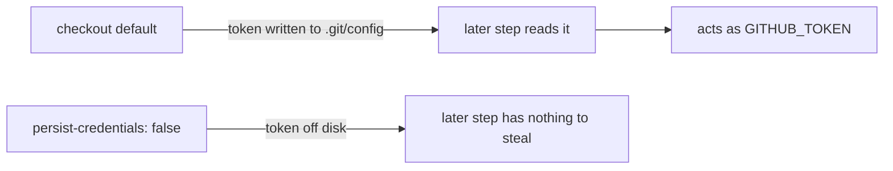

# Disable checkout credential persistence in `security.yml` (Issue #388)

## Summary

The `security` reusable workflow ran both `actions/checkout` steps with the
default `persist-credentials: true`, writing the workflow's `GITHUB_TOKEN` into
`.git/config` as an auth header. Any later step in the job — a compromised
dependency, an injected script — could read that token and act as it. The job
only reads the checked-out code and runs `cargo audit` / dependency-review; it
never pushes back and never fetches a private submodule, so the persisted
credential was pure blast radius.

This PR adds `persist-credentials: false` to both checkout steps, plus a
`quality.sh`-wired guard so the property cannot silently regress. Closes #388.

## Changes

- `.github/workflows/security.yml` — `persist-credentials: false` on both the
  main checkout and the NEAT-AI-core sibling checkout.
- `scripts/check-persist-credentials.sh` — new indentation-aware YAML scanner
  (same house style as `check-ci-permissions.sh`) that fails when any
  `actions/checkout` step in the target workflow omits `persist-credentials:
  false`. A documented `# best-practice-ignore: BP-PERSIST-CREDS — <reason>`
  comment above the `uses:` line is honoured as an explicit exception.
- `quality.sh` — runs the new check alongside the other workflow-hygiene gates.
- `README.md` — new "Checkout credential persistence" subsection documenting the
  rule and its escape hatch.



## Evidence

Backend/CI change — no web interface to screenshot. Verification is the new
check script plus its BATS suite.

`scripts/check-persist-credentials.sh` against the fixed workflow:

```text
OK   .../security.yml: checkout at line 23 sets persist-credentials: false
OK   .../security.yml: checkout at line 38 sets persist-credentials: false
```

`shellcheck` (clean) and `actionlint .github/workflows/security.yml` (clean)
both pass.

## Test Plan

- Added `tests/scripts/persist_credentials.bats` (8 tests):
  - passes when every checkout disables persistence;
  - fails when a checkout omits `persist-credentials: false` (reproduces the
    pre-fix state);
  - fails when only one of two checkouts disables it;
  - honours a documented `BP-PERSIST-CREDS` ignore;
  - fails when no checkout step is present;
  - errors on a missing workflow file / unknown flag;
  - asserts the real repo `security.yml` passes the rule.
- All new BATS tests pass; `shellcheck` and `actionlint` are clean.

### Note on the local quality gate

`./quality.sh` reports one unrelated failure —
`tests/scripts/cargo_metadata.bats::cargo metadata exposes the repository
field` — because this local checkout has no sibling `NEAT-AI-core` clone at
`../../NEAT-AI-core/neat-core`, so `cargo metadata` cannot resolve the
`neat-core` path dependency. It is environmental (CI checks the sibling out, as
this very workflow does) and cannot be affected by a workflow-YAML / shell /
docs change. Every workflow-hygiene check and the new suite pass.
