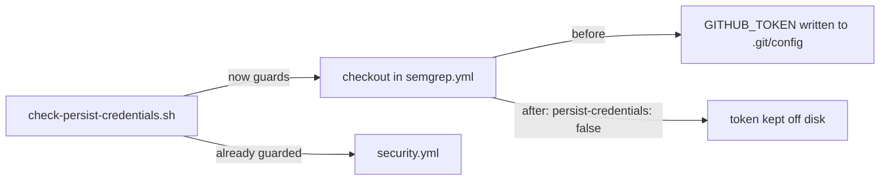

# Harden `semgrep.yml` checkout — disable credential persistence

## Summary

Job `semgrep` in `.github/workflows/semgrep.yml` ran `actions/checkout` without
`persist-credentials: false`, so the workflow's `GITHUB_TOKEN` was written into
`.git/config` where any later step in the job could read it. The job only reads
the checked-out code to run Semgrep — it never pushes back and never fetches a
private submodule — so the persisted credential was pure blast radius.

The fix adds `persist-credentials: false` to the checkout step, matching the
existing convention already used in `security.yml`. To stop this regressing, the
per-repo gate `scripts/check-persist-credentials.sh` (previously guarding only
`security.yml`) now validates `semgrep.yml` too, with a regression test.

Closes #389.

## Change flow

## Evidence

Backend/CI change only — no web interface to screenshot. Verified via the guard
script and BATS suite:

- `scripts/check-persist-credentials.sh` (default run) reports `OK` for every
  checkout in both `security.yml` and `semgrep.yml`.
- Regression check: stripping `persist-credentials: false` from a copy of
  `semgrep.yml` makes the guard exit non-zero with the
  `must set 'persist-credentials: false'` message.
- `shellcheck` and `actionlint` both pass on the changed files.

## Test Plan

- Extended `tests/scripts/persist_credentials.bats`:
  - `real repository semgrep.yml disables credential persistence (Issue #389)`
    — asserts the shipped `semgrep.yml` passes the guard.
  - `default run validates every guarded workflow (security.yml and semgrep.yml)`
    — asserts the no-argument run covers both workflows.
  - Pinned the existing `security.yml` test to an explicit `--workflow` path so
    single-file behaviour stays covered alongside the new default-set run.
- All 10 BATS cases pass.
