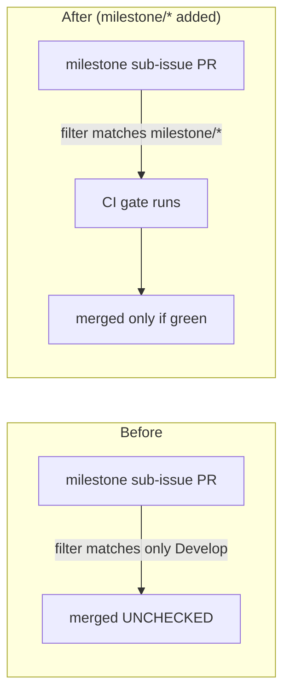

# CI quality workflow now gates milestone PRs

## Summary

The CI quality workflow (`.github/workflows/ci.yml`) only fired on pull requests
targeting `Develop`, so its `pull_request.branches` filter matched none of the
`milestone/<slug>` feature branches. Milestone sub-issue PRs target a shared
`milestone/<slug>` branch, so the gate never ran on them and they merged into
the milestone branch unchecked — the gap surfaced only later at the single
rollup PR into the default branch.

This adds `milestone/*` to the workflow's `pull_request.branches` filter so the
gate runs on every intermediate sub-issue PR too. Milestone branch names are
`milestone/<slug>` with no nested slashes, so the single-level `milestone/*`
glob is sufficient.

A purpose-built validator (`scripts/check-milestone-branch-filter.sh`, invoked
from `quality.sh`) fails loudly unless the filter includes the `milestone/*`
glob, and `tests/scripts/milestone_branch_filter.bats` covers it end-to-end so
the gate cannot silently regress.

Closes #393.

## Evidence

Backend/CI change — no web interface to screenshot. Verified via the validator
and its bats suite.



Validator against the fixed workflow:

```
$ ./scripts/check-milestone-branch-filter.sh
OK   .github/workflows/ci.yml: pull_request.branches includes 'milestone/*' — milestone PRs are gated
```

New bats suite (all pass):

```
1..7
ok 1 passes when pull_request.branches includes milestone/*
ok 2 fails when the milestone/* glob is absent
ok 3 fails when there is no pull_request.branches filter at all
ok 4 accepts the inline list form of branches
ok 5 reports an error when the workflow file does not exist
ok 6 unknown flag prints usage and exits non-zero
ok 7 the repository CI workflow gates milestone PRs
```

Full existing bats suite continues to pass (344 tests, 0 failures);
`shellcheck --severity=warning` and `codespell` are clean.

## Test Plan

- Added `scripts/check-milestone-branch-filter.sh` — parses
  `on.pull_request.branches` from `ci.yml` and fails unless `milestone/*` is
  present (both inline and block list forms).
- Added `tests/scripts/milestone_branch_filter.bats` — 7 cases covering the
  happy path, the absent-glob regression (fails against the pre-fix workflow),
  a missing branches filter, the inline list form, a missing file, an unknown
  flag, and the real repository `ci.yml`.
- Wired the validator into `quality.sh` alongside the other workflow checks.
- Updated `README.md` to reflect that `ci.yml` now also gates `milestone/*`
  PRs, with a pointer to the validator and its bats suite.
