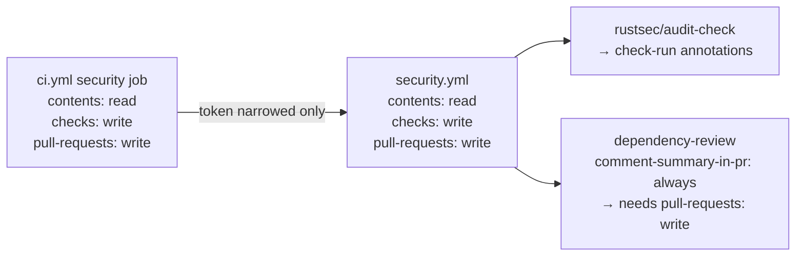

# Fix security.yml permissions mismatch (Issue #398)

## Summary

The reusable `.github/workflows/security.yml` and its sole caller (the `security`
job in `.github/workflows/ci.yml`) both granted `permissions: issues: write`,
but the block was never derived from the steps — it had two defects:

1. **`issues: write` was dead weight.** `security.yml` is invoked only from the
   `security` job in `ci.yml`, which is gated `if: github.event_name ==
   'pull_request'`. `rustsec/audit-check` only files repository issues on
   non-PR events (`push`/`schedule`); on `pull_request` it reports via check
   runs. So the write scope could never be exercised, needlessly widening the
   blast radius of every step in the job.
2. **`pull-requests: write` was missing.** The dependency-review step sets
   `comment-summary-in-pr: always`, and `actions/dependency-review-action`
   requires `pull-requests: write` to post that summary comment. Without it the
   configured comment silently never posted.

Fix: swap `issues: write` → `pull-requests: write` in **both** mirrored
permission blocks (a called workflow's token is only ever narrowed along the
caller chain, so both the caller job and the reusable workflow must grant the
scope). `scripts/check-ci-permissions.sh` now asserts the corrected
`checks: write` + `pull-requests: write` pairing, with its bats tests updated to
match. A `schedule`-triggered caller that ever wants issue filing can grant
`issues: write` itself.

Closes #398.

## Evidence

Backend/CI-only change — no web interface to screenshot. Verified via the
least-privilege validator and its test suite.

`scripts/check-ci-permissions.sh` against the real `ci.yml`:

```
OK   …/ci.yml: security job grants checks: write
OK   …/ci.yml: security job grants pull-requests: write
OK   …/ci.yml: security job grants contents: read
```

Token-scope narrowing along the caller chain:



## Test Plan

- Updated `tests/scripts/ci_permissions.bats`:
  - Canonical + failure fixtures now grant `pull-requests: write` (not
    `issues: write`).
  - Renamed `fails when the security job omits pull-requests: write` to assert
    the validator rejects a security job missing that scope.
- All 10 bats cases pass, including `real repository ci.yml satisfies every
  least-privilege rule`.
- `scripts/check-ci-permissions.sh` and `shellcheck` pass clean.
