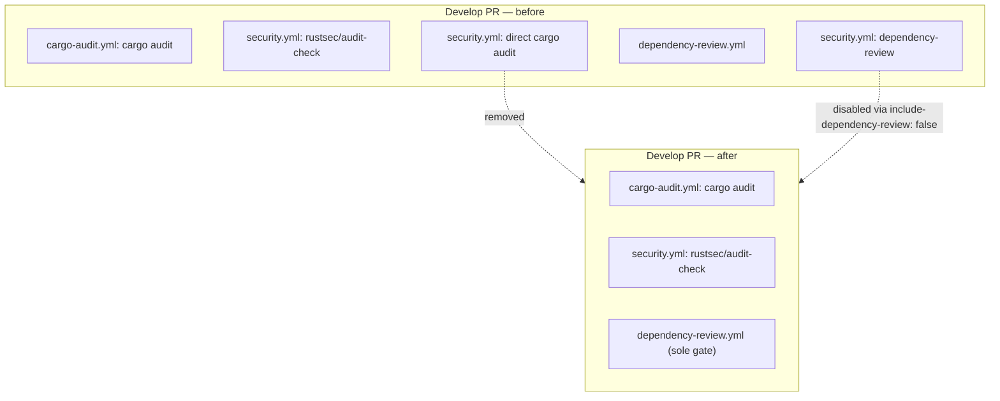

# De-duplicate cargo-audit and dependency-review on Develop PRs (Issue #399)

## Summary

On every PR into `Develop`, `cargo audit` ran **3×** and `dependency-review`
ran **2×** across three workflow files. This PR removes the pure duplication on
the dominant path without losing coverage on any branch. **Closes #399.**

- **cargo-audit (3 → 2):** removed the redundant second, direct `cargo audit`
  run from the reusable `security.yml` job. `rustsec/audit-check` already fails
  the check on any advisory, so a follow-up run against the identical
  `Cargo.lock` in the same job could not catch anything it missed. The
  standalone `cargo-audit.yml` still runs a prebuilt `cargo audit` on every PR
  (and on its weekly cron), so the belt-and-braces coverage of branches that
  bypass CI is unchanged.
- **dependency-review (2 → 1):** the reusable `security.yml` no longer runs the
  action — `ci.yml` now passes `include-dependency-review: false`. The
  standalone `dependency-review.yml` becomes the single universal gate. To keep
  it truly universal its `pull_request` filter was extended to
  `["*", "milestone/**"]`, so milestone `<slug>` sub-issue PRs (which a bare
  `*` glob does not match) keep dependency-review coverage now that the reusable
  path is off.

The reusable workflow retains the optional dependency-review capability (and the
`pull-requests: write` scope) behind its input, so a future caller can opt back
in.

### Coverage matrix (executions per PR)

| Target branch        | cargo-audit before | cargo-audit after | dep-review before | dep-review after |
|----------------------|:------------------:|:-----------------:|:-----------------:|:----------------:|
| `Develop`            | 3                  | 2                 | 2                 | 1                |
| `milestone/<slug>`   | 3                  | 2                 | 1                 | 1                |
| other single-level   | 1                  | 1                 | 1                 | 1                |

No cell decreases below 1 — every PR is still gated by both checks.

## Evidence

CI/workflow change only — no web interface to screenshot. Verified via the
repo's workflow validators and the bats helper suite (all run under
`quality.sh`):

- `scripts/check-prebuilt-tool-install.sh` — passes; `security.yml` dropped from
  the canonical cargo-audit pairs.
- `scripts/check-dependency-review-workflow.sh` — passes, including the new
  milestone-coverage rule.
- `scripts/check-ci-permissions.sh`, `check-cargo-audit-workflow.sh`,
  `check-workflow-action-versions.sh`, `check-persist-credentials.sh`,
  `check-readme-ci-alignment.sh` — all pass.
- `actionlint` — clean on the three edited workflows.
- Full `bats tests/scripts` — 349 tests pass, 0 failures.

## Test Plan

- `tests/scripts/prebuilt_tool_install.bats`
  - Updated the canonical-directory test to the three remaining pairs.
  - Added `security.yml is not a canonical cargo-audit pair (Issue #399)` —
    proves the validator passes when `security.yml` has no prebuilt cargo-audit
    install.
- `tests/scripts/dependency_review_workflow.bats`
  - Updated the canonical fixture to `["*", "milestone/**"]` and the OK-marker
    count 4 → 5.
  - Added `fails when the pull_request filter omits milestone branches (Issue
    #399)` — a regression guard so the sole dependency-review gate cannot
    silently drop milestone coverage.
- Existing `ci_permissions`, `cargo_audit_workflow`, `workflow_action_versions`
  and `persist_credentials` suites continue to pass unchanged.

No Rust source changed, so the cargo build/test/clippy/doc gates are unaffected.
