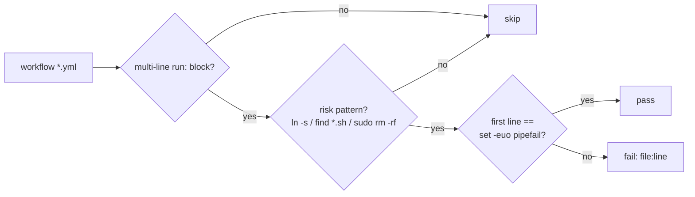

# Harden multi-line `run:` blocks with `set -euo pipefail`

## Summary

Several multi-line `run:` blocks in the workflow YAML did not begin with
`set -euo pipefail`, so a failing intermediate command could be swallowed and
the step still report success — a "false green" on gating checks and a
never-fail-silently hazard. This change adds `set -euo pipefail` as the first
line of each flagged block and adds a regression guard so the drift cannot
return. Closes #400.

Blocks fixed (matching the audit finding `BP-abcb2822fb7b`):

- `.github/workflows/ci.yml` — the "Link NEAT-AI-core sibling path expected by
  Cargo" symlink step (three copies), "Free up runner disk space"
  (`sudo rm -rf`), "Check bash script syntax" (`find … | while`), and
  "Run ShellCheck" (`find`-driven).
- `.github/workflows/security.yml` and `.github/workflows/sbom.yml` — two more
  copies of the symlink step.

This is drift between copies of the same blocks, not a missing convention:
`auto-format.yml`, `cargo-quality.yml`, `gitleaks.yml` and
`version-increment.yml` already open their multi-line scripts with
`set -euo pipefail`.

## Regression guard

Added `scripts/check-run-block-safety.sh` (wired into `quality.sh` and exercised
by `tests/scripts/run_block_safety.bats`). It scans every workflow for
*risk-bearing* multi-line `run: |` blocks — the NEAT-AI-core symlink
(`ln -s`), `find … -name "*.sh"` shell discovery, and privileged deletion
(`sudo rm -rf`) — and fails (listing each offender as `file:line`) if any does
not open with `set -euo pipefail`. Benign single-command line-continuation
blocks (e.g. a wrapped `cargo clippy` invocation) are deliberately not flagged.

## Evidence

Backend/CI-config change — no web interface to screenshot. Verified via:

- `./scripts/check-run-block-safety.sh` → passes against the real repo after the
  fix; reproduces the failure (`exit 1`, offender listed) against a reverted
  fixture.
- `bats tests/scripts` → all 358 tests pass, including the 9 new
  `run_block_safety.bats` cases.
- `shellcheck --severity=warning` and `bash -n` clean on the new script.
- `actionlint` clean on `ci.yml`, `security.yml`, `sbom.yml`.

## Test Plan

- Added `tests/scripts/run_block_safety.bats`:
  - passes when the symlink block opens with `set -euo pipefail`;
  - fails when the symlink / `find`-`*.sh` / `sudo rm -rf` blocks omit it;
  - reports every offending block across multiple files;
  - ignores a benign single-command continuation block;
  - errors on a missing workflows directory and on an unknown flag;
  - asserts the real repository keeps every risk-bearing block safe.
