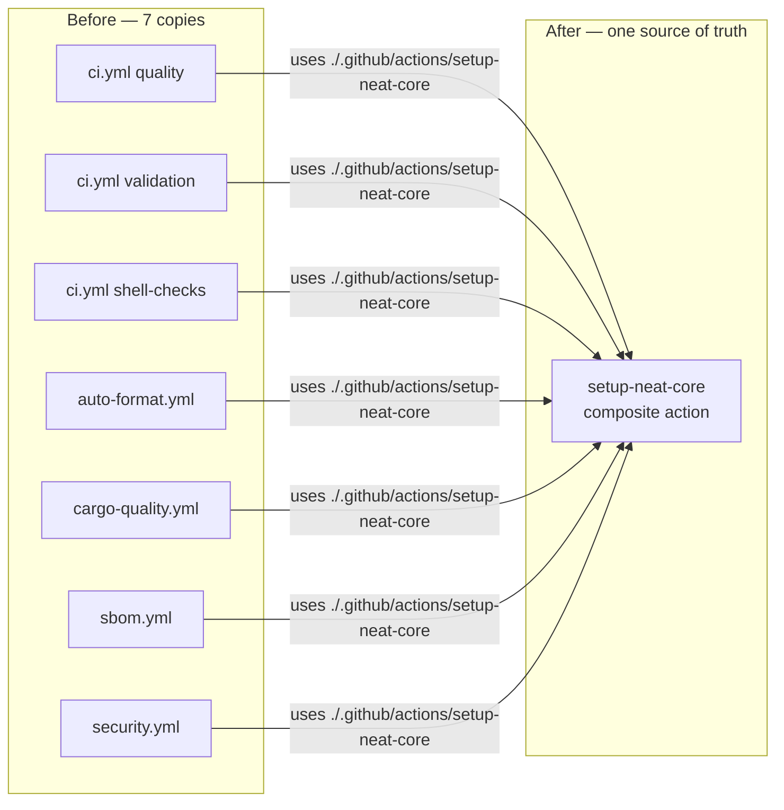

# Extract the NEAT-AI-core checkout + symlink block into a composite action

## Summary

The "checkout `stSoftwareAU/NEAT-AI-core@Develop` + symlink it to the sibling
path Cargo expects" block was copy-pasted across **seven call sites in five
workflow files** (`ci.yml` ×3, `auto-format.yml`, `cargo-quality.yml`,
`sbom.yml`, `security.yml`). The copies had already drifted, which is exactly
the failure mode duplication invites.

This PR extracts the block into a single local composite action,
`.github/actions/setup-neat-core/action.yml`, and replaces each copy with:

```yaml
- name: Set up NEAT-AI-core sibling (path dependency for neat-core)
  uses: ./.github/actions/setup-neat-core
```

The next path-strategy change (a different ref, a checkout option) is now a
one-file diff, and behaviour stays identical across every job that needs the
dependency. The composite sets `persist-credentials: false` (least privilege —
NEAT-AI-core is a public read-only clone that is never pushed back) and opens
its symlink script with `set -euo pipefail`, so both prior drift variants
converge on the safe form. Local `./` action references are exempt from the
SHA-pinning policy, and the third-party `actions/checkout` SHA stays pinned once
inside the composite — the supply-chain posture is unchanged.

Closes #401.

## What changed

- **New** `.github/actions/setup-neat-core/action.yml` — composite action
  (checkout + sibling symlink) with an optional `ref` input (default `Develop`).
- **Migrated** all 7 call sites in `ci.yml`, `auto-format.yml`,
  `cargo-quality.yml`, `sbom.yml`, `security.yml` to `uses:` the composite.
- **New guard** `scripts/check-neat-core-composite-action.sh` — fails if any
  workflow re-inlines a NEAT-AI-core checkout, if the composite is missing/
  malformed, or if its symlink block loses `set -euo pipefail`. Wired into
  `quality.sh`.
- **Extended guards** — `check-workflow-paths.sh`, `check-run-block-safety.sh`
  and `check-workflow-action-versions.sh` now also scan `.github/actions` in
  default mode, so the extracted block keeps its path-strategy, run-block-safety
  and SHA-pinning coverage instead of silently falling out of scope.

## Evidence

Backend/CI change — no web interface to screenshot. Verified with the shipped
shell guards and their BATS suites (all run with stdin from `/dev/null`).

Real-repo guard output after migration:

```text
$ ./scripts/check-neat-core-composite-action.sh
OK   composite action present: .../.github/actions/setup-neat-core/action.yml
OK   composite checks out stSoftwareAU/NEAT-AI-core
OK   composite has the sibling-link step
OK   composite symlink run block opens with 'set -euo pipefail'
OK   no workflow inlines a NEAT-AI-core checkout
OK   at least one workflow references the composite action
```

`actionlint`, `check-workflow-paths.sh`, `check-run-block-safety.sh`,
`check-workflow-action-versions.sh`, `check-persist-credentials.sh`,
`check-sbom-workflow.sh`, `check-auto-format-workflow.sh`,
`check-cargo-quality-workflow.sh`, `check-ci-job-graph.sh`,
`check-ci-permissions.sh` and `check-readme-ci-alignment.sh` all pass.



## Test Plan

- **New** `tests/scripts/neat_core_composite_action.bats` — 9 cases exercising
  `check-neat-core-composite-action.sh`: passes on a valid composite + consumer;
  fails on missing action, non-composite `using:`, a symlink block missing
  `set -euo pipefail`, a re-inlined checkout, and an unused composite; plus a
  real-repo assertion.
- **Existing suites re-run green** against the migrated tree:
  `workflow_neat_ai_core_path.bats` (path strategy now validated on the
  composite), `run_block_safety.bats`, `workflow_action_versions.bats`,
  `persist_credentials*.bats`, `sbom_workflow.bats`, `auto_format.bats`,
  `cargo_quality_workflow.bats`.

## Deno regression avoided

Not applicable — this is a Rust/GitHub Actions repository with no Deno markers.
