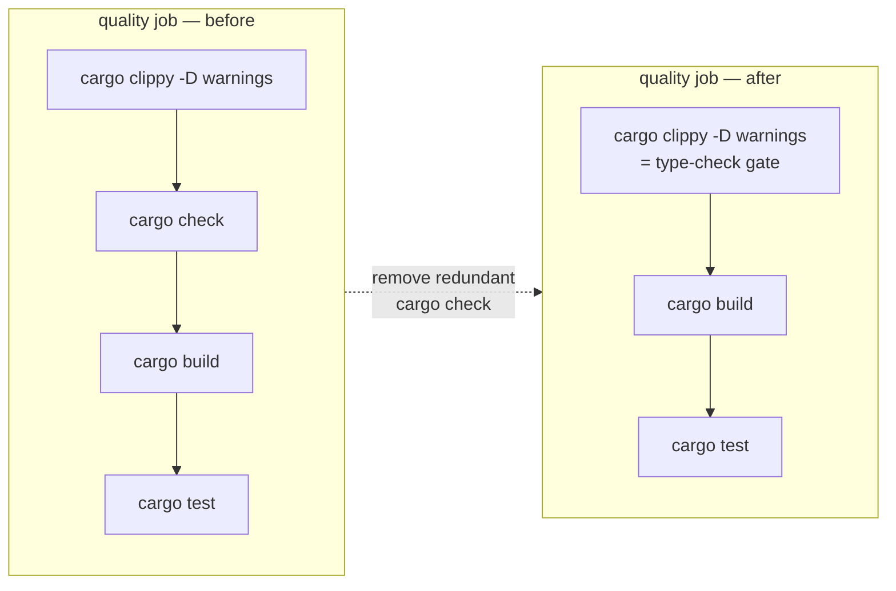

# PR Summary — Issue #403

## Summary

Removed the redundant `Check types` (`cargo check --all-targets --all-features`)
step from the `quality` job in `.github/workflows/ci.yml`. `cargo clippy` in the
preceding **Run linter** step drives the same rustc front-end over the identical
`--all-targets --all-features` scope and, with `-D warnings` (both on the clippy
invocation and the job-level `RUSTFLAGS`), denies every warning the check step
could surface — so "Check types" could only ever pass once clippy already had.
Because clippy uses its own rustc wrapper it does not share incremental
artefacts with `cargo check` either, so the step re-ran the front-end across the
whole workspace for no added coverage, burning wall-clock on the heaviest job in
the graph (30-minute timeout). Clippy is the strict type-check gate. Closes #403.

To keep the repo's README↔CI alignment invariant honest, the same redundant
command was dropped from the README "step-by-step (matches CI)" block and the
`scripts/check-readme-ci-alignment.sh` canonical command list, and the CI step
list in `AGENTS.md` was updated. The alignment guard now actively **rejects** a
re-introduced standalone `cargo check` step so the redundancy cannot silently
creep back.

## Evidence

Backend/CI-only change — no web interface to screenshot. Verified via the repo's
own shell/workflow validators and the bats suite:

- `bats tests/scripts` — **347 tests, 0 failures** (includes the updated
  `readme_ci_alignment.bats` and the ci.yml job-graph / timeout / permission
  validators).
- `./scripts/check-readme-ci-alignment.sh` — passes; README "matches CI" block
  matches the CI quality job (no `cargo check` on either side).
- `actionlint .github/workflows/ci.yml` — clean.
- `shellcheck --severity=warning scripts/check-readme-ci-alignment.sh` — clean.
- `./scripts/spell-check.sh` — no typos found.

The heavy cargo steps (`clippy`, `build`, `test`, `doc`) require the sibling
`../NEAT-AI-core` path dependency, which is not cloned in this environment
(documented in `AGENTS.md`); they are unaffected by removing a redundant CI step
and are exercised by CI on the PR.

## Test Plan

- **`tests/scripts/readme_ci_alignment.bats`** — replaced the now-obsolete
  "fails when cargo check is missing" case with
  **"fails when a redundant cargo check step is present (Issue #403)"**, which
  re-adds a standalone `cargo check` to the fixture and asserts the guard fails
  with a `redundant` message. Updated the aligned-README fixture to drop the
  `cargo check` line. All 9 cases pass, including the real-repository README
  check.
- **`scripts/check-readme-ci-alignment.sh`** — dropped `cargo check` from the
  canonical command list and added a negative rule rejecting a standalone
  `cargo check` step in the matches-CI block.
