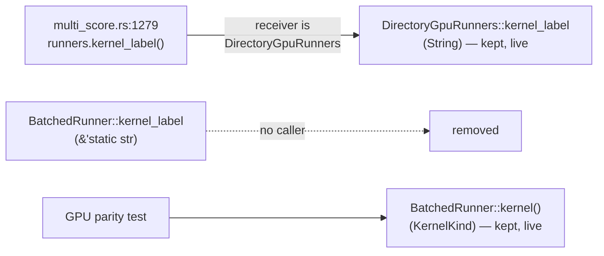

# PR Summary — Issue #428

## Summary

Removed the dead public method `BatchedRunner::kernel_label` in
`rust_scorer/src/gpu/forward_mse_batched.rs`. The method returned a
`&'static str` and had **no caller** anywhere in the repository. Closes #428.

Module-graph analysis confirmed the only `kernel_label()` call site
(`multi_score.rs:1279`) has a `DirectoryGpuRunners` receiver, so it resolves to
the `String`-returning `DirectoryGpuRunners::kernel_label` (line 1079) — not the
`BatchedRunner` method. That method carried
`#[allow(dead_code)] // superseded by DirectoryGpuRunners::kernel_label`, which
meant the workspace `unused = "deny"` hardening could never flag it. The doc
comment, the `#[allow(dead_code)]` attribute and the method body were deleted
together (former lines 634–643).

The sibling accessor `kernel()` (returning `KernelKind`) is **kept** — it is
live surface consumed by the GPU parity integration test, as its own annotation
notes.

An incidental `Cargo.lock` sync (`rust_scorer` `1.1.23` → `1.1.24`) came from
`cargo check`: the lockfile was stale against the already-bumped manifest.

## Evidence

Backend/CLI-only change — no web interface to screenshot.

- `cargo check --workspace --all-targets` stays green after the deletion
  (verified locally, `Finished dev profile`).
- `./quality.sh` passes except for one **pre-existing** unrelated failure
  ("the repository Markdown Lint workflow gates milestone PRs" in
  `tests/scripts/milestone_branch_filter.bats`), confirmed to fail identically
  on the clean base tree via `git stash`. It touches no file changed here.
- Whole-repo `grep -rn "kernel_label" --include="*.rs"` confirms no remaining
  reference to the removed `BatchedRunner` method.

## Test Plan

This is a pure removal of unused code; the enforcing verification is that the
compiler and all targets stay green with the method gone. The removal is guarded
by the existing workspace `unused = "deny"` lint on all non-`allow`-annotated
code and by the full test suite in `./quality.sh` (`cargo test`), which compiles
and runs `--all-targets`.

- Verified `cargo check --workspace --all-targets` compiles cleanly.
- Verified the GPU parity integration test still references the retained
  `kernel()` accessor and does **not** reference the removed `kernel_label()`.
- No test asserted on `BatchedRunner::kernel_label`, so no test required
  modification or removal.
