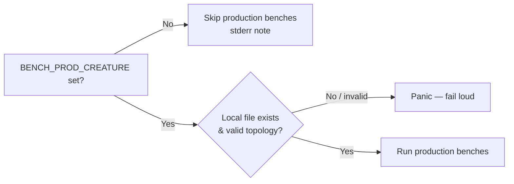

## Summary

Deleted the production benchmark's runtime access to the **private**
cluster-data repository so this public repo is fully
self-contained and its benches are reproducible outside the organisation
(check 1 — runtime access to a private repo). Closes #448.

The private raw URL and the `curl` fetch path are gone. The production
benchmark now runs **only** when a contributor supplies their own **local**
`network.json` via `BENCH_PROD_CREATURE`; when it is unset the production
benches skip cleanly (exactly like the GPU benches skip without an adapter).
There is no remote or on-disk default that could reach a private repo.

### Changes

- **`rust_scorer/src/prod_fixture.rs`**
  - Removed `PRODUCTION_CREATURE_URL` (the private-repo raw URL) and
    `fetch_creature_to` (the `curl` shell-out), plus the now-unused
    `std::process::Command` import.
  - Removed `DEFAULT_CACHE_REL_PATH` and `resolve_creature_path` (a fetch-cache
    default that only existed to serve the deleted fetch).
  - Added `production_creature_path_from_env() -> Option<PathBuf>`: resolves a
    **local** override only, returning `None` (skip) when unset — no default.
- **`rust_scorer/benches/scoring.rs`**
  - Dropped the removed imports; `prod_fixture()` now returns
    `Option<&'static ProdFixture>` and returns `None` (with a skip note) when no
    local creature is supplied. The three production bench functions skip on
    `None`. The fail-loud contract is preserved once a local creature *is*
    supplied.
- **`scripts/run-benches.sh`**, **`scripts/profile-flamegraph.sh`** — removed the
  private raw-URL fetch documentation/hints; both now describe the local-path
  gate and state nothing is fetched.
- **`docs/performance-baseline.md`** — replaced the "fetched from the private
  URL at bench time" wording (and the raw-URL link) with the local-path-only,
  fetch-nothing description.

### Fail-loud (Issue #3234)

Skipping is confined to the single "no local fixture supplied" case, which is an
opt-in resource like a GPU adapter — the bench emits an explicit stderr skip
note. Once a local creature is supplied, any read/parse/topology failure still
panics; the fixture never silently falls back to the synthetic creature.

## Data flow

No remote fetch remains anywhere in the path.

## Evidence

Backend/CLI change — no web interface to screenshot. Verified via tests and the
bench build:

- `cargo test -p rust_scorer --lib prod_fixture` — 9 passed, including the new
  `production_creature_path_reads_local_env_only`.
- `cargo build -p rust_scorer --benches` — compiles cleanly with the removed
  imports and the `Option`-returning `prod_fixture()`.
- `grep` confirms no live source/script reference to the private cluster-data
  repository's `raw.githubusercontent.com` path remains.

## Test Plan

- **Replaced** `prod_fixture::tests::resolve_creature_path_prefers_env_override`
  (which tested the deleted `resolve_creature_path` default-cache behaviour)
  with `production_creature_path_reads_local_env_only`, asserting:
  - unset → `None` (skip; no private-repo default),
  - blank → `None`,
  - a set path → `Some(path)`.
  This is a documented business-logic change: the default-cache path only existed
  to serve the now-deleted fetch.
- Existing `prod_fixture` parse/topology/corpus tests remain unchanged and pass.
