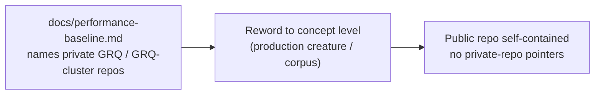

## Summary

Reworded every private-repo reference in `docs/performance-baseline.md` to
**concept level** so this public repository stays self-contained. The file
previously named and described the production creature and corpus by the
**private** `stSoftwareAU/GRQ-cluster` (and `GRQ`) repo names — check 3 of the
`private-repo-reference-audit` (textual private-repo name mention in docs).
Naming a private repo in public docs points every public reader at content they
cannot see. Closes #449.

The change is **purely documentary** — no code, benchmark, or test behaviour is
affected. All 32 `GRQ` / `GRQ-cluster` mentions were replaced with
characteristic-level phrasing that keeps the technical meaning intact:

- "GRQ-cluster creature" / "GRQ creature" → "production creature" /
  "production-scale creature" (the topology — ≈1666 neurons, 2461 inputs, 34
  squash types — is already described in-file).
- `/path/to/GRQ-cluster/network.json` invocation examples →
  `/path/to/production/network.json`.
- "the real GRQ `network.json` was unreachable (`GRQ-cluster/main/network.json`
  → HTTP 404)" → "the real production `network.json` was unreachable (the
  private production creature is not available to the unattended worker)" — the
  dead raw-URL pointer is gone.
- "GRQ production" / "GRQ-scale" / "GRQ hosts" / "GRQ corpus" → "production"
  variants throughout (decision headings, topology notes, env-tuning guidance).

The raw `raw.githubusercontent.com/stSoftwareAU/GRQ-cluster/...` links the audit
cited at lines 17/669 were already removed by the related #448 work; no
`raw.githubusercontent` links remain in the file.

The existing concept-level sentence "The creature lives in a private repository;
contributors with access provide their own local copy" was left as-is — it
already describes the source without naming the private repo.

## Evidence

Documentation-only change — no web UI to screenshot. Verification:

- `grep -iE "GRQ|raw.githubusercontent" docs/performance-baseline.md` →
  **no matches** (was 32 `GRQ`/`GRQ-cluster` lines before).
- `markdownlint-cli2 docs/performance-baseline.md` → **0 errors**.
- `codespell --config .codespellrc docs/performance-baseline.md` → **clean**.

## Test Plan

No unit tests apply — the change edits published Markdown prose only, and a
grep-for-a-string test over docs would not exercise real code (per the repo's
"no source-grep tests" rule). Verification is the grep / markdownlint /
codespell checks listed under Evidence, plus the full `./quality.sh` gate.
