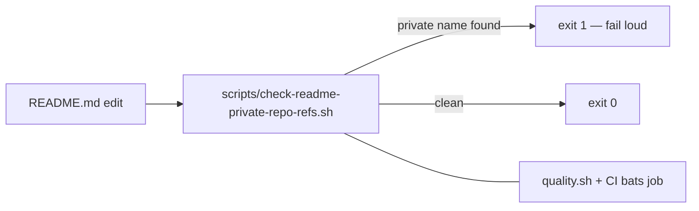

## Summary

`README.md` named the **private** `stSoftwareAU/GRQ` and `stSoftwareAU/GRQ-cluster`
repositories in public documentation — check 3 of the private-repo-reference audit.
Reworded all 12 mentions to concept-level phrasing ("production creature",
"production-scale pools", "production hosts", record byte size) so the public README
stays fully self-contained, and added a permanent guard so the references cannot
creep back in. No code or runtime behaviour changed.

Closes #450.

Rewording (same style as the sibling `docs/performance-baseline.md` change, Issue #449):

| Before | After |
|---|---|
| scratch/mixed **GRQ-scale** pools | scratch/mixed **production-scale** pools |
| **GRQ-scale** creatures (total neurons >256) | **production-scale** creatures (total neurons >256) |
| `score_from_creature_dir` (N=63, **GRQ** scratch) | `score_from_creature_dir` (N=63, **production** scratch) |
| the real **GRQ-cluster** creature | the real **production** creature |
| production **GRQ** creatures | **production-scale** creatures |
| the real **GRQ** corpus | the real **production** corpus |
| `"GRQ-10-1"` / `"GRQ-12-1"` JSON keys | `"creature-10-1"` / `"creature-12-1"` |
| Production **GRQ-cluster** records are 9848 bytes | Production records are 9848 bytes |
| On **GRQ** hosts / within **GRQ** host RAM headroom | On **production** hosts / within **production** host RAM headroom |

The `NEAT-AI*` dependency-table rows (public repos) and the private
automation-repo reference (tracked separately, Issue #451) are untouched, as the
issue specifies.

## Evidence

Documentation-only change — there is no web interface to screenshot. Verified by the
new regression guard and the full local gate:

- `scripts/check-readme-private-repo-refs.sh` — exits 1 with every offending line when
  the README names `GRQ` / `GRQ-cluster`, exits 0 on the current README. Fails loud on a
  missing README (exit 1) and on an unknown argument (exit 2).
- Wired into `quality.sh`; CI already runs `bats tests/scripts`, and the suite includes a
  test asserting the **shipped** README passes the guard, so CI enforces it on every PR.
- `./quality.sh < /dev/null` → `✅ All quality checks passed!` (shellcheck, bats, fmt,
  clippy, tests, rustdoc, release build).

## Test Plan

Added `tests/scripts/readme_private_repo_refs.bats` (7 tests, all passing):

- passes on a README with concept-level production wording
- fails when the README names the private `GRQ` repo
- fails when the README names the private `GRQ-cluster` repo
- reports every offending line, not just the first
- fails loudly when the README path does not exist
- rejects an unknown argument with a usage error
- the shipped `README.md` passes the guard (regression test for this issue — it fails
  against the pre-fix README and passes after the rewording)

No existing tests were modified or removed.
