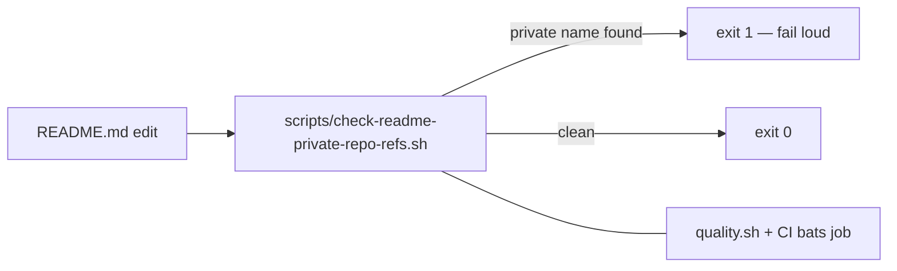

## Summary

`README.md` named the **private** production-data and cluster-data repositories in
public documentation — check 3 of the private-repo-reference audit.
Reworded all 12 mentions to concept-level phrasing ("production creature",
"production-scale pools", "production hosts", record byte size) so the public README
stays fully self-contained, and added a permanent guard so the references cannot
creep back in. No code or runtime behaviour changed.

Closes #450.

Rewording (same style as the sibling `docs/performance-baseline.md` change, Issue #449):

The private repo name is elided as **…** in the "Before" column so this summary
does not reintroduce what it removed.

| Before (private repo name used as…) | After |
|---|---|
| scale adjective — scratch/mixed **…-scale** pools | scratch/mixed **production-scale** pools |
| scale adjective — **…-scale** creatures (total neurons >256) | **production-scale** creatures (total neurons >256) |
| bench label — `score_from_creature_dir` (N=63, **…** scratch) | `score_from_creature_dir` (N=63, **production** scratch) |
| creature qualifier — the real **…** creature | the real **production** creature |
| creature qualifier — production **…** creatures | **production-scale** creatures |
| corpus qualifier — the real **…** corpus | the real **production** corpus |
| JSON keys — `"…-10-1"` / `"…-12-1"` | `"creature-10-1"` / `"creature-12-1"` |
| record-size note — Production **…** records are 9848 bytes | Production records are 9848 bytes |
| host qualifier — On **…** hosts / within **…** host RAM headroom | On **production** hosts / within **production** host RAM headroom |

The `NEAT-AI*` dependency-table rows (public repos) and the private
automation-repo reference (tracked separately, Issue #451) are untouched, as the
issue specifies.

## Evidence

Documentation-only change — there is no web interface to screenshot. Verified by the
new regression guard and the full local gate:

- `scripts/check-readme-private-repo-refs.sh` — exits 1 with every offending line when
  the README names either private repository, exits 0 on the current README. Fails loud
  on a missing README (exit 1) and on an unknown argument (exit 2).
- Wired into `quality.sh`; CI already runs `bats tests/scripts`, and the suite includes a
  test asserting the **shipped** README passes the guard, so CI enforces it on every PR.
- `./quality.sh < /dev/null` → `✅ All quality checks passed!` (shellcheck, bats, fmt,
  clippy, tests, rustdoc, release build).

## Test Plan

Added `tests/scripts/readme_private_repo_refs.bats` (7 tests, all passing):

- passes on a README with concept-level production wording
- fails when the README names the private production-data repo
- fails when the README names the private cluster-data repo
- reports every offending line, not just the first
- fails loudly when the README path does not exist
- rejects an unknown argument with a usage error
- the shipped `README.md` passes the guard (regression test for this issue — it fails
  against the pre-fix README and passes after the rewording)

No existing tests were modified or removed.
