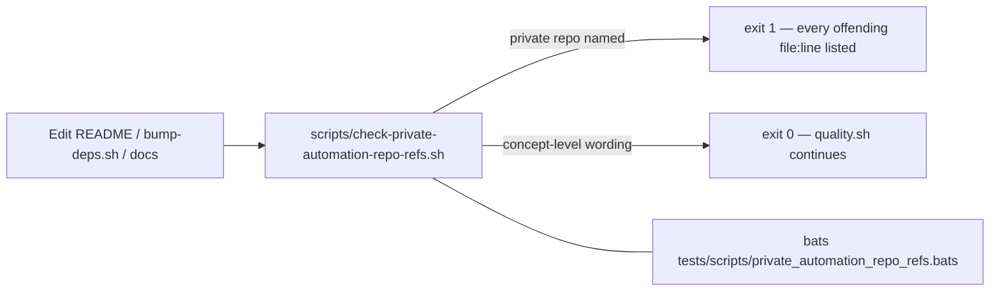

# Reword private automation-repo references to concept level (Issue #451)

## Summary

Several files named the **private** `stSoftwareAU` automation repository together with
an issue number that no public reader can open — check 3 of the private-repo-reference
audit. Each reference is now reworded to concept level: the pre-`quality.sh` dependency
refresher is described by what it does ("invoked by the automation worker before
`quality.sh`, per the standing dependency-bump contract") without citing a private slug.
A regression guard keeps the tree clean. Closes #451.

| Before | After |
| --- | --- |
| `bump-deps.sh:5` — "per the contract in `stSoftwareAU/Vibe…#1613`" | "per the standing dependency-bump contract" |
| `README.md:799` — "invoked by the Vibe Coder worker before `quality.sh` (per …#1613)" | "invoked by the automation worker before `quality.sh`, per the standing dependency-bump contract" |
| `docs/pr-summary-55.md:4` — "invoked by the Vibe Coder worker per …#1613" | "invoked by the automation worker per the standing dependency-bump contract" |
| `docs/archive/pr-summaries/pr-summary-450.md:27` — names the private slug as "tracked separately" | "the private automation-repo reference (tracked separately, Issue #451)" |

No behaviour changes — `bump-deps.sh` logic, the CLI contract and the dependency graph
are untouched.

## Evidence

Documentation/comment-only change with a new shell guard — there is no web interface to
screenshot. Verified by the new regression guard and the full local gate.

- `scripts/check-private-automation-repo-refs.sh` — greps the tree (excluding `.git`,
  `target` and itself) for the private automation repo name, exits 1 listing **every**
  offending file:line, exits 0 on the current tree. Fails loud on a missing root
  (exit 1) and on an unknown argument (exit 2) — no silent pass.
- Wired into `quality.sh` alongside the Issue #450 README guard; CI already runs
  `bats tests/scripts`, and the suite includes a test asserting the **shipped** tree
  passes, so CI enforces it on every PR.
- `./quality.sh < /dev/null` → `✅ All quality checks passed!` (shellcheck, bats, fmt,
  clippy, cargo-deny, build, test, rustdoc, release build).

## Test Plan

Added `tests/scripts/private_automation_repo_refs.bats` (8 tests, synthetic trees in a
temp dir so the real tree is never mutated):

- passes on a tree with concept-level automation wording (exit 0)
- fails when a markdown file names the private automation repo (exit 1)
- fails when a shell comment names the private automation repo (exit 1)
- matches the repo name without an issue number
- reports every offending file, not just the first
- fails loudly when the root does not exist (exit 1)
- rejects an unknown argument with a usage error (exit 2)
- the shipped tree passes the guard — the regression test for this issue: it fails
  against the unfixed tree and passes after the rewording

Existing suites (`tests/scripts/bump_deps.bats`, the full bats directory and the Rust
tests) are unchanged and still pass.
