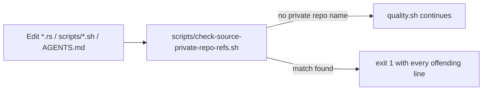

## Summary

Incidental Rust source comments, test identifiers, a string literal,
`scripts/profile-flamegraph.sh` and `AGENTS.md` named a **private**
`stSoftwareAU` repository as shorthand for production scale, topology and the
production creature. A public repository must be self-contained, so every such
mention is reworded to concept level — property-based phrasing such as
"production-scale", "the production creature", ">256-neuron scratch topology"
and "~9848 B/record". No runtime behaviour changes; only comments, identifiers
and one non-semantic test label were touched. Closes #452.

A guard script now keeps the rewording from regressing, mirroring the existing
Issue #450 (README) and Issue #451 (automation repo) guards.

### What changed

- **Reworded to concept level** — `rust_scorer/src/gpu/mod.rs`,
  `rust_scorer/src/gpu/forward_mse_batched.rs`,
  `rust_scorer/src/multi_score.rs`, `rust_scorer/src/read_tuning.rs`,
  `rust_scorer/src/prod_fixture.rs`, `rust_scorer/benches/scoring.rs`,
  `rust_scorer/tests/directory_mode_tdd.rs`,
  `rust_scorer/tests/gpu_multi_score_parity.rs`,
  `rust_scorer/tests/gpu_pipelined_scratch_multi_bin.rs`,
  `rust_scorer/tests/scorer_smoke.rs`, `scripts/profile-flamegraph.sh`,
  `AGENTS.md`.
- **Renamed identifiers** — the two private-repo-prefixed test names became
  `directory_mode_auto_production_scale_topology_uses_cpu` and
  `default_read_bytes_scales_for_production_records`, the private-repo-prefixed
  fixture became `production-scale.json`, and the parity label became
  `"production"`.
- **New guard** — `scripts/check-source-private-repo-refs.sh` scans tracked
  `*.rs`, `scripts/*.sh` and `AGENTS.md` for the private repo names and exits
  1 with every offending line. Wired into `quality.sh`. The guard itself and
  its Issue #450 sibling are excluded (they necessarily spell what they
  forbid); historical records (`CHANGELOG.md`, archived PR summaries) are
  deliberately out of scope — they document what was said at the time.

## Evidence

Backend/CLI-only change — no web interface to screenshot. Verified by the
local gate:

- `./quality.sh < /dev/null` → **`✅ All quality checks passed!`** (shellcheck,
  all guard scripts, bats, `fmt --check`, clippy, build, full test suite,
  rustdoc, release build).
- `bats tests/scripts/source_private_repo_refs.bats` → **11/11 passing**. The
  final test (`the shipped tree passes the guard`) failed before the rewording
  and passes after it, so it is a genuine regression test for this issue.
- The renamed Rust tests
  (`directory_mode_auto_production_scale_topology_uses_cpu`,
  `default_read_bytes_scales_for_production_records`) pass unchanged in
  substance — only their names and fixture labels moved.

## Test Plan

- Added `tests/scripts/source_private_repo_refs.bats` (11 cases):
  - passes on concept-level production wording;
  - fails on a private name in a Rust comment, in a test identifier / string
    literal, in `AGENTS.md`, and in a shell script;
  - ignores historical records outside the guarded scope;
  - reports every offending line, not just the first;
  - does not match unrelated identifiers that merely share the letters;
  - fails loudly on a missing root; usage error on an unknown argument;
  - asserts the shipped tree passes the guard (the regression gate).
- No existing tests were removed, disabled or weakened; two were renamed to
  drop the private repo name from their identifiers.
