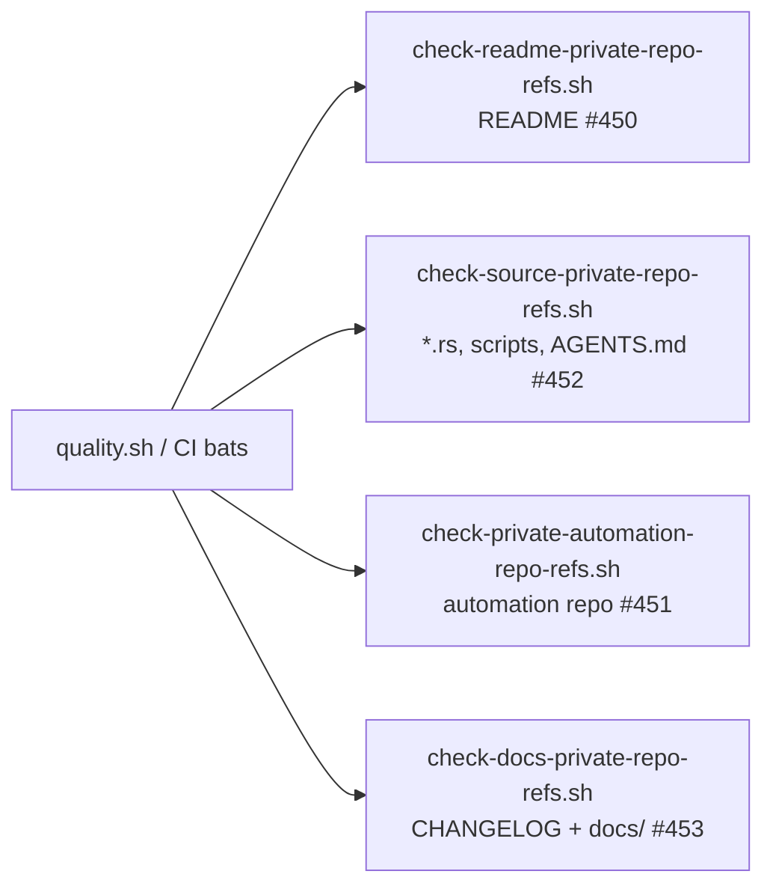

# Reword private-repo mentions in the changelog and archived PR summaries

## Summary

The public repo's historical documentation — `CHANGELOG.md`, `docs/pr-summary-11.md`
and nine archived PR summaries — still named a **private** `stSoftwareAU`
repository. This is check 3 of the private-repo-reference audit (incidental,
archival name mentions): archived summaries and the changelog are public
documentation, and naming a private repo points public readers at content they
cannot see.

Per the check-3 remediation tier the mentions are reworded to **concept level**,
preserving the historical narrative:

| Before (private name) | After (concept level) |
| --- | --- |
| the real *private-repo* creature | the real **production** creature |
| *private-repo* hosts / host RAM headroom | **production** hosts / host RAM headroom |
| large-record *private-repo* corpora | large-record **production** corpora |
| full 521-bin *private-repo* corpus | full 521-bin **production** corpus |
| `/path/to/<private-repo>/network.json` | `/path/to/production/network.json` |
| *private-repo* operators | **production** operators |

A new per-repo gate, `scripts/check-docs-private-repo-refs.sh`, keeps them clean:
it scans `CHANGELOG.md` and everything under `docs/` (any depth) for the private
repo names as whole words and **fails loud** with every offending file:line. The
three PR summaries that document the audit itself (#448, #449, #450) necessarily
quote the names they removed and are the only allowlisted files. The guard is
wired into `quality.sh` and covered by BATS, which CI runs.

This completes the guard set alongside `check-readme-private-repo-refs.sh`
(#450, README), `check-source-private-repo-refs.sh` (#452, sources/scripts/
`AGENTS.md`) and `check-private-automation-repo-refs.sh` (#451). The #452 guard's
"historical records are deliberately out of scope" comment now points at the new
docs guard.

Closes #453.

## Evidence

Documentation/CLI-only change — there is no web interface to screenshot. Evidence
is the guard's own behaviour:

- Before the reword, `./scripts/check-docs-private-repo-refs.sh` exited **1** and
  listed 38 offending lines across 11 files.
- After the reword it exits **0**:
  `✅ CHANGELOG and docs free of private repo references`.
- `./quality.sh` passes end to end (shellcheck, cargo-deny, fmt, clippy, build,
  test, rustdoc, release build, all guards, 424 BATS tests).

## Test Plan

New BATS suite `tests/scripts/docs_private_repo_refs.bats` (9 tests) — each runs
the real script against synthetic fixtures and asserts exit codes and output:

- passes on a changelog with concept-level production wording
- fails when the changelog names the private repo (exit 1, offending file
  reported)
- fails when an archived PR summary names the private cluster repo
- reports **every** offending file, not just the first
- ignores markdown outside `CHANGELOG.md` and `docs/`
- allows the allowlisted remediation summaries
- fails loudly when the root does not exist (exit 1)
- rejects an unknown argument with a usage error (exit 2)
- **regression test:** the shipped `CHANGELOG.md` and `docs/` tree pass the guard
  — this test fails against the unfixed tree and passes after the reword

Existing suites are unchanged and all 424 BATS tests pass.
